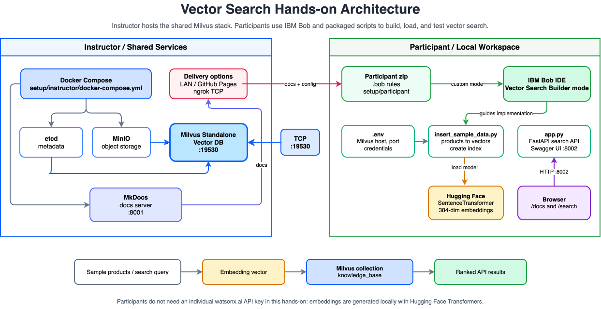

# Vector Search Hands-on

[](https://github.com/mukoubuchi/vector-search-hands-on/actions/workflows/ci.yml)
[](https://github.com/mukoubuchi/vector-search-hands-on/actions/workflows/e2e-smoke.yml)
[](https://mukoubuchi.github.io/vector-search-hands-on/)
[](https://github.com/mukoubuchi/vector-search-hands-on/releases/latest)
[](LICENSE)


Next-generation vector search in practice using **Building Blocks** and **IBM Bob**

## Features of This Hands-on

### Value of Building Blocks + IBM Bob

This hands-on demonstrates how combining **Building Blocks** (pre-built technical components) with **IBM Bob** (an AI development assistant) can complete development that would typically take days to weeks in **approximately 90 minutes**.

| Development Method | Time Required | Required Skills | Code Quality |
|---------|---------|------------|-----------|
| **Traditional development** | Days to weeks | Programming, DB design, API design | Depends on developer skills |
| **IBM Bob only** | Hours to days | Basic technical understanding | High quality but time-consuming |
| **Building Blocks + IBM Bob** | Minutes to hours | Just natural language instructions | Production-level high quality |

### Building Block Used

**Vector Search Builder** (Milvus-based)

- Milvus database setup and management
- Local embedding model integration with Hugging Face Transformers
- Sample product data ingestion workflow
- Vector search optimization

### Integration with IBM Bob

Using Vector Search Builder mode, IBM Bob provides:

- AI assistant specialized for Vector Search
- Code generation with understanding of Building Blocks features
- Implementation support based on best practices
- Feature addition and customization via natural language instructions

## Architecture



## Quick Start

### For Instructors

#### Port Configuration

This hands-on uses the following ports:

| Service | Port | URL | Purpose |
|---------|--------|-----|------|
| **MkDocs (development)** | 8000 | <http://localhost:8000> | Document editing (with auto-reload) |
| **MkDocs (container)** | 8001 | <http://localhost:8001> | Participant sharing (stable delivery) |
| **FastAPI (Swagger UI)** | 8002 | <http://localhost:8002/docs> | Vector Search API (for participants) |
| **Milvus** | 19530 | localhost:19530 | Vector database |

**Important**:

- Port 8000 is dedicated to MkDocs development (for instructor document editing)
- Port 8002 is the FastAPI app (participants access Swagger UI)
- Direct participants to `http://localhost:8002/docs`

#### Remote Delivery Setup

This hands-on assumes remote participants. Use GitHub Pages for the documentation. For Milvus, **prefer a private network (Tailscale, VPN) or an organization-approved cloud endpoint**; use an ngrok TCP tunnel only as a fallback — Milvus gRPC traffic is not TLS-encrypted, so credentials and data transit an ngrok tunnel in cleartext.

Milvus credentials are generated automatically: `./start-all.sh` replaces the default `root/Milvus` password with a random one on first start, prints it, and stores it as `MILVUS_PASSWORD` in `setup/instructor/.env`. Share that password with participants.

**1. Publish documentation with GitHub Pages**

> **Note**: Free accounts require the repository to be **Public**

```bash
# 1. Create a Public repository on GitHub.com and update remote
git remote set-url origin https://github.com/mukoubuchi/vector-search-hands-on.git
git push -u origin main

# 2. Configure GitHub repository settings
# Settings -> Pages -> Source: select "GitHub Actions"

# 3. After auto-deploy completes, access at:
# https://mukoubuchi.github.io/vector-search-hands-on/
```

**2-a. Expose Milvus over a private network (recommended)**

Use Tailscale, an organization VPN, or a cloud VM so that traffic never crosses the public internet unencrypted:

```bash
# 1. Start Milvus environment (generates and prints the root password)
cd setup/instructor
./start-all.sh

# 2. Share with participants
# - Milvus host: the instructor's private-network address (e.g. Tailscale IP), port 19530
# - Milvus password: the value printed by start-all.sh
```

**2-b. Fallback: publish Milvus with ngrok TCP**

> **Security note**: Milvus gRPC traffic is **not TLS-encrypted**, so the password and data transit the ngrok tunnel in cleartext on the public internet. Use this only for throwaway hands-on data, and stop the tunnel immediately after the session. Authentication itself is enforced (`COMMON_SECURITY_AUTHORIZATIONENABLED=true`) with the password generated by `start-all.sh`.

> **Note**: ngrok TCP endpoints may require account identity verification, such as adding a credit or debit card, even on a free account. If `ERR_NGROK_8013` appears, complete ngrok verification or use one of the alternatives above.

> **Network note**: Corporate VPN or DNS security products such as Cisco Umbrella may block ngrok TCP tunnels or prevent the ngrok hostname from resolving correctly. Disconnecting the VPN may not be enough if Cisco Umbrella or a similar product remains active. If participants cannot connect through ngrok, use an organization-approved same-network, private-network, or cloud VM alternative.

```bash
# 1. Start Milvus environment (generates and prints the root password)
cd setup/instructor
./start-all.sh

# 2. Start a TCP tunnel in a separate terminal
ngrok tcp 19530
```

If ngrok shows:

```text
Forwarding  tcp://0.tcp.jp.ngrok.io:12345 -> localhost:19530
```

share these values with remote participants:

```env
MILVUS_HOST=0.tcp.jp.ngrok.io
MILVUS_PORT=12345
MILVUS_USER=root
MILVUS_PASSWORD=<the password printed by start-all.sh>
```

Participants must update `MILVUS_HOST`, `MILVUS_PORT`, and `MILVUS_PASSWORD` in `setup/participant/.env`, and set `COLLECTION_NAME` to a name unique to each participant (e.g. `products_taro`) because the Milvus instance is shared. Do not include `tcp://` in `MILVUS_HOST`.

**3. Stop the environment after hands-on**

```bash
cd setup/instructor
./stop-all.sh
# Stops Milvus, MkDocs, and any FastAPI demo running on port 8002
```

**Alternative: Local delivery (same network only)**

Use this only when participants are on the same LAN, Wi-Fi, or VPN.

```bash
# 1. Start Milvus environment and MkDocs
cd setup/instructor
./start-all.sh

# 2. Check IP address
ifconfig | grep "inet " | grep -v 127.0.0.1

# 3. Share with participants
# - Milvus: <IP address>:19530 (root / password printed by start-all.sh)
# - Documentation: http://<IP address>:8001
```

**Other delivery methods:**

- A public cloud VM that runs Milvus or forwards TCP `19530`
- ngrok HTTP for temporary documentation access
- Cloudflare Tunnel (free, fixed URL)

Details: [setup/instructor/deploy-docs-to-cloud.md](setup/instructor/deploy-docs-to-cloud.md)

### For Participants

**Distributed files** (instructors download them from the [latest release assets](https://github.com/mukoubuchi/vector-search-hands-on/releases/latest), or build them with `./setup/instructor/build-participant-zips.sh`):

- `vector-search-builder-en.zip` — Minimal participant package with English rules and scripts
- `vector-search-builder-ja.zip` — Minimal participant package with Japanese rules and scripts (日本語版)

The two packages use the same participant scripts. Each package includes only the sample data file for its language, and its packaged `.env.example` is generated from the matching source template (`.env.example.en` / `.env.example.ja`) so sample product data and runtime messages match the hands-on language.

The participant scripts read Milvus credentials from `setup/participant/.env`; credentials are not hardcoded in the Python code. Production-oriented review suggestions such as validation, logging, CORS restrictions, caching, and tests are treated as Part 3 code review discussion points.

Each zip contains only:

- `.bob/custom_modes.yaml`
- `.bob/rules-vector-search-builder/` (3 XML rule files)
- `setup/participant/` (`.env.example`, Python scripts, and `requirements.txt`)

Instructor files, documentation files, local `.env` files, Python caches, and system files are intentionally excluded.

**Setup steps**:

1. Extract the zip file for your language

   - English: `vector-search-builder-en.zip`
   - Japanese: `vector-search-builder-ja.zip`
   - Mac: Double-click
   - Windows: Right-click → "Extract All"

2. Open the extracted folder in IBM Bob IDE

   - `File` → `Open Folder`

3. Configure connection information received from instructor

   - Copy `setup/participant/.env.example` to create `setup/participant/.env`
   - For remote sessions, set both `MILVUS_HOST` and `MILVUS_PORT` to the values shared by the instructor
   - For same-network sessions, set the IP address shared by the instructor in `MILVUS_HOST`
   - Set `MILVUS_PASSWORD` to the password distributed by the instructor
   - Set `COLLECTION_NAME` to a name unique to you (e.g. `products_taro`) — Milvus is shared by all participants

4. Reload IBM Bob

   - Mac: `Cmd+Shift+P` → "Reload Window"
   - Windows: `Ctrl+Shift+P` → "Reload Window"

5. Select Vector Search Builder mode

   - "Vector Search Builder" appears in the "Mode" selector at the bottom right
   - Select "Vector Search Builder" from the "Mode" selector

6. Start hands-on

Details: [docs/preparation.md](docs/preparation.md)

## Hands-on Flow

| Part | Content | Time | Learning |
|-------|------|---------|---------|
| [Preparation](docs/preparation.md) | Building Block setup | 15 min | Vector Search Builder installation |
| [Part 1](docs/part1.md) | Experience Vector Search | 20 min | How semantic search works and its value |
| [Part 2](docs/part2.md) | Add features with IBM Bob | 30 min | Development experience via natural language |
| [Part 3](docs/part3.md) | Verification and review | 15 min | Code quality verification |
| [Summary](docs/summary.md) | Review and Q&A | 10 min | Value recap and next steps |

**Total**: approximately 90 minutes

## What You'll Learn

### Value of Building Blocks

- **Ready to use**: Start immediately without complex configuration or learning
- **Best practices**: Optimal implementation patterns designed by IBM's engineering team
- **Domain-specific**: Provides Vector Search-specific guidance and implementation patterns
- **Customizable**: Flexibly extend to meet business requirements using IBM Bob

### Utilizing IBM Bob

- **Natural language instructions**: Just tell it what you want to do
- **Automatic code generation**: Automatically generates high-quality code
- **Code review**: Points out code issues
- **Integration with Building Blocks**: Provides technology-specific support through custom modes

### Improved Development Efficiency

**Traditional development**:

- Read Milvus documentation (hours)
- Learn Python SDK (hours)
- Select and integrate embedding model (hours to days)
- Implement code from scratch (days)

**Building Blocks + IBM Bob**:

- Install Vector Search Builder (minutes)
- Give natural language instructions to IBM Bob (minutes)
- Done (minutes to hours)

## Documentation

### For Instructors

- **Document delivery methods**: [`setup/instructor/deploy-docs-to-cloud.md`](setup/instructor/deploy-docs-to-cloud.md)
- **Instructor information sharing**: [`setup/instructor/instructor-share-info.md`](setup/instructor/instructor-share-info.md)
- **Translation sync guide**: [docs/translation-sync.md](docs/translation-sync.md) (internal source guide; excluded from the published MkDocs navigation)

### For Participants

- **Preparation**: [docs/preparation.md](docs/preparation.md)
- **Part 1 - Experience Vector Search**: [docs/part1.md](docs/part1.md)
- **Part 2 - Add features with IBM Bob**: [docs/part2.md](docs/part2.md)
- **Part 3 - Verification and review**: [docs/part3.md](docs/part3.md)
- **Summary**: [docs/summary.md](docs/summary.md)
- **Feedback**: [docs/feedback.md](docs/feedback.md)

### Japanese Documentation

All documentation is available in Japanese under [`docs/ja/`](docs/ja/).

### For Developers

- **Translation sync**: English and Japanese participant-facing docs and paired SVG diagrams are sync-checked by GitHub Actions. Pull Requests fail when counterparts are missing; pushes to `main` create a tracking issue. See [Translation Sync Guide](docs/translation-sync.md) for details. This guide is kept in source control but excluded from the published MkDocs site.
- **GitHub Actions**: Automated workflows for CI checks ([`.github/workflows/ci.yml`](.github/workflows/ci.yml)), GitHub Pages deployment ([`.github/workflows/deploy-docs.yml`](.github/workflows/deploy-docs.yml)), translation sync ([`.github/workflows/sync-translations.yml`](.github/workflows/sync-translations.yml), [`.github/workflows/sync-translations-ja-to-en.yml`](.github/workflows/sync-translations-ja-to-en.yml)), the E2E smoke test ([`.github/workflows/e2e-smoke.yml`](.github/workflows/e2e-smoke.yml)), and release packaging ([`.github/workflows/release.yml`](.github/workflows/release.yml)).
- **Releasing**: run the E2E smoke test on `main` first, then create a GitHub release with a `vX.Y.Z` tag (e.g. `gh release create v1.3.0 --title v1.3.0 --notes "..."`). The release workflow builds the participant zips from the tagged sources and attaches them to the release automatically.

## Required Tools

**Instructors**: a container runtime — Colima or Podman recommended (Docker Desktop also works where your organization licenses it) — and Python 3 with `pymilvus` (used by `start-all.sh` to rotate the Milvus root password)

**Participants**: IBM Bob 1.0.3 (IDE with Building Blocks support)

## Unique Innovations in This Hands-on

### 1. Instructor-Participant Separation Architecture

**Building Blocks alone**:

- Each person builds their own Milvus environment (Docker/Podman/Colima)
- Individually downloads embedding models (approximately 460 MB)
- Environment setup takes about 30 minutes

**This hands-on's innovation**:

- **Instructor**: Centrally manages Milvus environment (`setup/instructor/docker-compose.yml`)
- **Participants**: Participate with IBM Bob, the Vector Search Builder mode, participant scripts, and connection information only
- **Result**: Setup time reduced from 30 minutes to 5 minutes

### 2. Hybrid Delivery Support

**Building Blocks alone**:

- Assumes local environment execution

**This hands-on's innovation**:

- **On-site**: Local network sharing (`http://instructor IP:8001`)
- **Remote**: Document deployment to GitHub Pages
- **Result**: Supports on-site/remote/hybrid delivery

### 3. API Key-Free Design

**Building Blocks alone**:

- Cloud-based embedding options often require API keys
- Participants configure credentials individually

**This hands-on's innovation**:

- **Hugging Face Transformers** used (no API key required)
- **Local execution**: Works with internet connection only
- **Result**: Reduces participant preparation burden

### 4. Progressive Learning Path

**Building Blocks alone**:

- Focuses on technical implementation

**This hands-on's innovation**:

- **Part 1**: Experience Vector Search (understanding)
- **Part 2**: Add features with IBM Bob (practice)
- **Part 3**: Code review and improvement (application)
- **Result**: Even beginners can progress from understanding → practice → application

## Other Building Blocks Features

In addition to Vector Search Builder, there are many Building Blocks with dedicated Bob Modes:

- **Agent Builder**: Build autonomous AI agents and voice-enabled agents
- **Multi-Agent Orchestration**: Coordinated control of multiple agents
- **Agent Ops**: AI agent operations management and performance monitoring
- **Model Evaluation**: Evaluation of Gen AI/predictive ML models
- **Text2SQL**: Generate SQL queries from natural language
- **Data Pipeline AI-Generated**: Automated data pipeline generation
- **Zero-Copy Lakehouse**: Lakehouse construction without data copying
- **IaaS**: Terraform/CloudFormation template generation
- **Automated Resilience and Compliance**: Automated resilience and compliance
- **Automated Resource Management**: Automated resource management and cost optimization
- **Secrets Management**: Management of secrets and non-human identities

Details: [Building Blocks Documentation](https://ibm-self-serve-assets.github.io/building-blocks-docs/)

## Tech Stack

- **Building Block**: Vector Search Builder (Milvus-based)
- **AI Development Assistant**: IBM Bob
- **Vector Database**: Milvus 2.6.18 (pymilvus 2.6.15)
- **Embedding Model**: Hugging Face Transformers (`paraphrase-multilingual-MiniLM-L12-v2`, sentence-transformers 5.5)
- **Web Framework**: FastAPI 0.136 / Uvicorn
- **Programming Language**: Python 3.11
- **Documentation**: MkDocs Material (with i18n plugin — English / 日本語)
- **CI/CD**: GitHub Actions (auto-deploy to GitHub Pages, translation sync check, lint, zip packaging, E2E smoke test)

## Directory Structure

```
vector-search-hands-on/
├── .bob/                                  # Building Block (Vector Search Builder mode)
│   ├── custom_modes.yaml                  # IBM Bob custom mode definition
│   └── rules-vector-search-builder/       # Vector Search Builder specific rules
│       ├── 1_vector_search_workflow.xml
│       ├── 2_best_practices.xml
│       └── 3_common_patterns.xml
├── .github/                               # GitHub Actions and Dependabot configuration
│   ├── dependabot.yml                     # Automated dependency updates
│   └── workflows/
│       ├── ci.yml                         # CI checks (lint, build, zip verification)
│       ├── deploy-docs.yml                # GitHub Pages auto-deploy
│       ├── e2e-smoke.yml                  # Full-stack smoke test (manual trigger)
│       ├── release.yml                    # Attach participant zips to releases
│       ├── sync-translations.yml          # Translation sync check (EN → JA, PR + main)
│       └── sync-translations-ja-to-en.yml # Translation sync check (JA → EN, PR + main)
├── docs/                                  # Hands-on documentation (MkDocs)
│   ├── index.md                           # Home
│   ├── preparation.md                     # Preparation
│   ├── part1.md                           # Part 1: Experience Vector Search
│   ├── part2.md                           # Part 2: Add features with IBM Bob
│   ├── part3.md                           # Part 3: Verification and Review
│   ├── summary.md                         # Summary
│   ├── feedback.md                        # Participant feedback form
│   ├── translation-sync.md                # Internal translation sync guide (excluded from MkDocs nav)
│   ├── readme.md                          # docs/ directory structure guide
│   ├── ja/                                # Japanese translations
│   │   ├── readme.md                      # Japanese docs directory structure guide
│   │   ├── index.md                       # Home
│   │   ├── preparation.md                 # Preparation
│   │   ├── part1.md                       # Part 1: Experience Vector Search
│   │   ├── part2.md                       # Part 2: Add features with IBM Bob
│   │   ├── part3.md                       # Part 3: Verification and Review
│   │   ├── summary.md                     # Summary
│   │   ├── feedback.md                    # Participant feedback form
│   │   └── translation-sync.md            # Internal translation sync guide (excluded from MkDocs nav)
│   ├── images/                            # Diagrams and SVG images (EN/JA where needed)
│   ├── javascripts/                       # Custom JavaScript
│   ├── stylesheets/                       # Custom CSS
│   └── overrides/                         # Theme customization
├── setup/
│   ├── instructor/                        # Instructor setup
│   │   ├── docker-compose.yml             # Milvus environment definition
│   │   ├── mkdocs.Dockerfile              # Docs container image (pinned plugins)
│   │   ├── .env.example                   # Environment variables template
│   │   ├── start-all.sh                   # Start services, generate credentials
│   │   ├── stop-all.sh                    # Stop services and FastAPI demo on port 8002
│   │   ├── build-participant-zips.sh      # Regenerate participant distribution zips
│   │   ├── deploy-docs-to-cloud.md        # Document delivery methods
│   │   └── instructor-share-info.md       # Instructor information sharing
│   └── participant/                       # Participant setup
│       ├── .env.example.en                # English connection information template
│       ├── .env.example.ja                # Japanese connection information template
│       ├── requirements.txt               # Python dependencies
│       ├── common.py                      # Shared environment, language, connection, and model helpers
│       ├── schema.py                      # Shared Milvus schema, index, and search settings
│       ├── app.py                         # FastAPI vector search application
│       ├── insert_sample_data.py          # Sample data insertion script
│       ├── sample_products.py             # Language-aware sample data selector
│       ├── sample_products_en.py          # English sample product data
│       ├── sample_products_ja.py          # Japanese sample product data
│       ├── test_connection.py             # Connection test
│       └── test_embeddings_hf.py          # Embedding model test
├── lib/                                   # Common libraries
│   ├── common.sh                          # Common shell functions
│   └── check_translation_sync.sh          # Shared translation sync checker
├── LICENSE                                # Apache-2.0 license
├── mkdocs.yml                             # MkDocs configuration
└── README.md                              # This file
```

The participant distribution zips (`vector-search-builder-en.zip` / `vector-search-builder-ja.zip`) are **not committed**: they are built from the sources by the release workflow and attached to every GitHub release.

### Distribution Zip Contents

The participant zip files are intentionally minimal and contain only the files needed by participants.

How the packages are distributed:

- **Releases (canonical)**: on every `v*` tag push, the release workflow builds the zips from the repository sources and attaches them to the GitHub release — download them from the [release page](https://github.com/mukoubuchi/vector-search-hands-on/releases)
- **Local build**: to package the current working tree (e.g. between releases), run `./setup/instructor/build-participant-zips.sh`; the zips are written to the repository root and are gitignored

CI builds the zips on every push to ensure the packaging script keeps working.

- `vector-search-builder-en.zip`
- `vector-search-builder-ja.zip`

Common files:

```
.bob/custom_modes.yaml
.bob/rules-vector-search-builder/1_vector_search_workflow.xml
.bob/rules-vector-search-builder/2_best_practices.xml
.bob/rules-vector-search-builder/3_common_patterns.xml
setup/participant/.env.example
setup/participant/app.py
setup/participant/common.py
setup/participant/insert_sample_data.py
setup/participant/requirements.txt
setup/participant/sample_products.py
setup/participant/schema.py
setup/participant/test_connection.py
setup/participant/test_embeddings_hf.py
```

Language-specific sample data:

- `vector-search-builder-en.zip`: `setup/participant/sample_products_en.py`
- `vector-search-builder-ja.zip`: `setup/participant/sample_products_ja.py`

Language-specific `.env.example` source template:

- `vector-search-builder-en.zip`: generated from `setup/participant/.env.example.en`
- `vector-search-builder-ja.zip`: generated from `setup/participant/.env.example.ja`

Milvus credentials in the packaged `.env.example` are copied into `.env` by participants and read from environment variables at runtime. `test_connection.py`, `insert_sample_data.py`, and `app.py` all use the shared helpers in `common.py`, so user/password connection settings behave consistently.

Do not include `docs/`, `setup/instructor/`, local `.env` files, `__pycache__/`, `.DS_Store`, or other generated/local files in participant zip packages.

### Key Directory Descriptions

#### `.bob/` - Building Block

**Vector Search Builder mode definition** (provided by IBM)

- `custom_modes.yaml` — IBM Bob custom mode registration
- `rules-vector-search-builder/` — Vector Search-specialized rules (workflow, best practices, common patterns)
- IBM Bob provides Vector Search-specialized support
- Understands how to operate Milvus database
- Applies vector search best practices
- Knows how to integrate embedding models

#### `docs/` - Hands-on Documentation

**Learning content built with MkDocs Material**

- Progressive learning path (understanding → practice → application)
- Interactive code examples
- Visual diagrams and animations

#### `setup/instructor/` - Instructor Environment

**Centralized Milvus environment management**

- Environment setup with Docker Compose
- One-command start/stop for Milvus, MkDocs, and the FastAPI demo port
- Network sharing and remote delivery support

#### `setup/participant/` - Participant Tools

**FastAPI application and connection tests**

- `app.py` — FastAPI vector search application (Swagger UI at port 8002)
- `insert_sample_data.py` — Sample product data insertion script
- `common.py` — Shared language selection, `.env` loading, Milvus authentication, and embedding model loading
- `schema.py` — Shared collection schema, index parameters, search parameters, and product text mapping
- `sample_products.py` and the package-specific `sample_products_en.py` or `sample_products_ja.py` — Language-specific sample product data selected by `PARTICIPANT_LANGUAGE`
- Milvus connection test
- Embedding model verification
- Environment variable configuration template

## Support

If you have questions or encounter issues, please ask the instructor.

## License

This project is licensed under the [Apache License 2.0](LICENSE).
