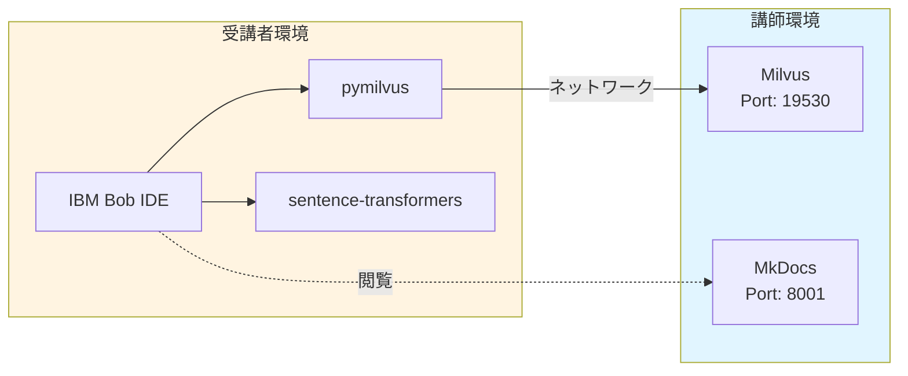
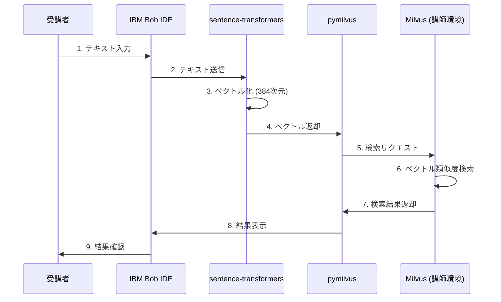

# Vector Search ハンズオン

講師が Milvus 環境を提供し、受講者は IBM Bob IDE のみで参加できるハンズオン環境です。

## 📦 配布ファイルについて

### setup/participant/vector-search-builder.zip（現在）

**配布場所:** `setup/participant/vector-search-builder.zip`

**含まれるファイル:**
```
vector-search-builder.zip
├── .bob/                           # Vector Search Builderモード定義
│   ├── custom_modes.yaml
│   └── rules-vector-search-builder/
│       ├── 1_vector_search_workflow.xml
│       ├── 2_best_practices.xml
│       └── 3_common_patterns.xml
└── setup/                          # 受講者用セットアップファイル
    ├── .env.example                # 接続情報テンプレート
    ├── requirements.txt            # Pythonパッケージリスト
    ├── test_embeddings_hf.py       # 埋め込みモデルテスト
    ├── test_connection_simple.py   # シンプルな接続テスト
    └── test_connection.py          # 詳細な接続テスト
```

**変更理由:**
- setupディレクトリをinstructor/participantに分割
- 講師用と受講者用のファイルを明確に分離
- MkDocsドキュメントとの整合性を確保

**講師専用ファイル（setup/instructor/）:**
- `docker-compose.yml` - Milvus環境
- `docker-compose-docs.yml` - MkDocsサーバー
- `start-all.sh` / `stop-all.sh` - 起動/停止スクリプト
- `instructor-share-info.md` - 講師用共有情報準備ガイド
- `deploy-docs-to-cloud.md` - リモート参加者対応ガイド
- `check_docs_url.sh` - Code Engine URL確認スクリプト
- `README.md` - 講師用セットアップガイド

### バージョン1.0（旧版）- .bobのみ

**含まれるファイル:**
```
vector-search-builder.zip
└── .bob/                           # Vector Search Builderモード定義のみ
    ├── custom_modes.yaml
    └── rules-vector-search-builder/
```

**問題点:**
- setupフォルダが含まれていない
- 受講者がsetupフォルダを手動で作成する必要がある
- MkDocsドキュメントと整合性がない

## 🔄 最新の改善（2026-05-18）

### ドキュメントサイトの最適化
- **Material for MkDocsのデフォルト仕様を最大限活用**
  - タブセレクタのカスタムスタイルを削除し、デフォルトデザインを採用
  - タスクリストの色指定を削除し、デフォルト色（緑）を使用
  - コードの可読性と保守性が向上

- **プロジェクト構造の整理**
  - 古い`docs/setup/`ディレクトリを削除（`setup/`に統合済み）
  - 重複ファイルを削除し、一貫性のある構造に

- **カスタマイズの最小化**
  - CSSとJavaScriptを必要最小限に
  - Material for MkDocsのアップデートに強い構造

## ✨ 主な特徴

### 🎯 受講者にとって
- ✅ **APIキー不要** - Hugging Face Transformersを使用（完全無料）
- ✅ **環境構築不要** - IBM Bob IDEだけでOK
- ✅ **オフライン対応** - モデルダウンロード後はネット不要
- ✅ **段階的学習** - 実践手順書で迷わず進められる

### 👨‍🏫 講師にとって
- ✅ **一元管理** - Milvus + MkDocsをDocker Composeで提供
- ✅ **コスト削減** - 受講者のAPI利用料金が不要
- ✅ **簡単セットアップ** - `./start-all.sh`で全サービス起動
- ✅ **リモート対応** - Code Engineで世界中からアクセス可能
- ✅ **柔軟な運用** - Watsonx.ai版への切り替えも可能（git checkout）

## 🏗️ システムアーキテクチャ



### データフロー



### 主な特徴

**講師側**:
- Docker Composeで全サービスを一元管理
- `./start-all.sh`で簡単起動
- 受講者にIPアドレスと認証情報を共有するだけ

**受講者側**:
- IBM Bob IDEのみで完結（ローカル環境構築不要）
- Hugging Face Transformersで埋め込み生成（APIキー不要）
- 初回のみモデルダウンロード、以降はオフライン可能

---

## 📁 ディレクトリ構造

```
vector-search-handson/
├── .bob/                           # IBM Bob IDEカスタムモード定義
│   ├── custom_modes.yaml
│   └── rules-vector-search-builder/
├── docs/
│   ├── README.md                   # ドキュメント構成の説明
│   ├── instructor-walkthrough.md   # 講師用実践手順書
│   ├── instructor/                 # 講師向けドキュメント
│   │   └── ibm-products-comparison.md
│   └── participant/                # 受講者向けドキュメント
│       ├── README.md               # 受講者向けガイド
│       ├── hands-on-procedure.md   # 受講者用実践手順書
│       ├── mkdocs.yml              # MkDocs設定
│       ├── serve-docs.sh           # 簡易サーバー起動（macOS/Linux）
│       ├── serve-docs.bat          # 簡易サーバー起動（Windows）
│       ├── start-docs.sh           # MkDocsサーバー起動（開発者向け）
│       ├── start-docs.bat          # MkDocsサーバー起動（開発者向け）
│       ├── deploy-to-code-engine.sh # Code Engineデプロイスクリプト
│       ├── Dockerfile              # Code Engine用Dockerイメージ
│       └── docs/                   # MkDocsコンテンツ
│           ├── index.md            # ハンズオン概要
│           ├── preparation.md      # 事前準備
│           ├── part1.md            # Part 1: 基本的なベクトル検索
│           ├── part2.md            # Part 2: 高度な検索機能
│           ├── part3.md            # Part 3: 実践的な応用
│           ├── summary.md          # まとめ
│           ├── stylesheets/        # カスタムCSS
│           │   └── extra.css
│           ├── javascripts/        # カスタムJavaScript
│           │   └── extra.js
│           └── overrides/          # テンプレートオーバーライド
│               └── main.html
├── setup/
│   ├── README.md                   # セットアップ全体説明
│   ├── instructor/                 # 講師専用ファイル
│   │   ├── README.md               # 講師用セットアップガイド
│   │   ├── docker-compose.yml      # Milvus 環境設定
│   │   ├── docker-compose-docs.yml # MkDocsサーバー設定
│   │   ├── start-all.sh            # 全サービス起動スクリプト
│   │   ├── stop-all.sh             # 全サービス停止スクリプト
│   │   ├── instructor-share-info.md # 講師用共有情報準備ガイド
│   │   ├── deploy-docs-to-cloud.md # リモート参加者対応ガイド
│   │   ├── check_docs_url.sh       # Code Engine URL確認スクリプト
│   │   └── techzone-code-engine-guide.md # TechZone環境ガイド
│   └── participant/                # 受講者配布用ファイル
│       ├── README.md               # 受講者用セットアップガイド
│       ├── .env.example            # 接続設定テンプレート
│       ├── requirements.txt        # Pythonパッケージリスト
│       ├── test_embeddings_hf.py   # 埋め込みモデルテスト
│       ├── test_connection_simple.py # シンプルな接続テスト
│       ├── test_connection.py      # 詳細な接続テスト
│       └── vector-search-builder.zip # IBM Bob IDEモード定義
├── worklog.md                      # 開発作業ログ
└── README.md                       # このファイル
```

## 🚀 クイックスタート

### 📚 ドキュメントの使い分け

| 対象者 | 使用するドキュメント | 特徴 |
|--------|---------------------|------|
| **受講者（初心者）** | [受講者用実践手順書](docs/participant/hands-on-procedure.md) | 段階的な実践手順・コード例付き |
| **受講者（Web版）** | MkDocsドキュメント（講師がホスト） | 詳しい説明・ナビゲーション・検索機能 |
| **講師・経験者** | [講師用実践手順書](docs/instructor-walkthrough.md) | 簡潔な手順・進行ガイド |

---

### 講師の方

#### 事前準備
1. Docker Desktop をインストール
2. **すべてのサービスを一括起動**:
   ```bash
   cd setup/instructor
   ./start-all.sh
   ```
   これで以下が起動します:
   - Milvus（ポート 19530）
   - MkDocsドキュメントサーバー（ポート 8001）

3. **受講者に以下を共有**:
   - Milvus接続情報（IPアドレス、ポート、認証情報）
   - **ドキュメントURL**: `https://mkdocs-docs.xxxxx.us-south.codeengine.appdomain.cloud`
     > **注意**: **xxxxx**の部分は環境により異なります（あくまで例）。必ず講師から共有された最新のURLを使用してください。
   - **重要**: Watsonx.ai APIキーは不要（Hugging Face Transformersを使用）

#### ドキュメントのデプロイ

IBM Cloud Code Engineにドキュメントをデプロイ：

```bash
cd docs/participant
./deploy-to-code-engine.sh
```

詳細は [リモート参加者対応ガイド](setup/instructor/deploy-docs-to-cloud.md) を参照。

#### ハンズオン当日
1. **[講師用実践手順書](docs/instructor-walkthrough.md)** を進行ガイドとして使用
2. 各ステップの所要時間を確認しながら進行
3. チェックリストで受講者の進捗を管理

#### ハンズオン終了後
```bash
cd setup/instructor
./stop-all.sh
```

---

### 受講者の方

#### ✅ 必要なもの

**IBM Bob IDE + ネット環境だけでOK！**
- ✅ IBM Bob IDE（コード実行環境）
- ✅ インターネット接続
- ✅ ブラウザ（ドキュメント閲覧用、オプション）

**不要なもの:**
- ❌ ローカルへのPythonインストール
- ❌ パッケージの手動インストール
- ❌ 複雑な環境構築
- ❌ **Watsonx.ai APIキー不要**（Hugging Face Transformersを使用）

#### 📖 2つの学習方法

**方法1: 実践手順書で学ぶ（推奨）**
1. [受講者用実践手順書](docs/participant/hands-on-procedure.md)を開く
2. IBM Bob IDEに指示を出してコードを作成・実行
3. 各ステップの期待される出力を確認

**方法2: Webドキュメントで学ぶ**
1. **講師から共有されたドキュメントURLにアクセス**:
   - **ドキュメントURL**: `https://mkdocs-docs.xxxxx.us-south.codeengine.appdomain.cloud`
     > **注意**: **xxxxx**の部分は環境により異なります（あくまで例）。必ず講師から共有された最新のURLを使用してください。
2. ナビゲーションと検索機能を活用
3. 詳しい説明を参照しながら進める

#### 事前準備
1. IBM Bob IDEを起動
2. 講師から提供された接続情報を受け取る:
   - Milvus接続情報（IPアドレス、ポート、認証情報）
3. Bob IDEで環境セットアップ（Bobが自動実行）
   - 必要なパッケージ: `pymilvus`, `sentence-transformers`, `python-dotenv`
   - 埋め込みモデル: Hugging Face Transformers（APIキー不要、無料）

#### ハンズオン当日
1. **実践手順書**または**Webドキュメント**を見ながら進める
2. 各Partのコードを実行し、動作を確認
3. 分からないことは講師に質問

**実践手順書のメリット**:
- ✅ 完全なコード例が含まれている
- ✅ 期待される出力が明示されている
- ✅ トラブルシューティングガイド付き
- ✅ オフラインでも参照可能

**Webドキュメントのメリット**:
- ✅ ナビゲーション・検索機能が使える
- ✅ 全員が同じバージョンを見られる
- ✅ 詳しい説明と図解

## 📖 詳細ドキュメント

### 講師向け
- [講師向けガイド](docs/instructor/README.md)
- [環境セットアップガイド](docs/instructor/setup-guide.md)
- [リモート参加者対応ガイド](setup/instructor/deploy-docs-to-cloud.md) ⭐ 新規
- [TechZone環境ガイド](setup/instructor/techzone-code-engine-guide.md)
- [IBM製品との比較](docs/instructor/ibm-products-comparison.md)
- [セットアップファイル説明](setup/README.md)

### 受講者向け
- **[受講者用実践手順書](docs/participant/hands-on-procedure.md)** ⭐ 推奨
- [受講者向けガイド](docs/participant/README.md)
- MkDocsドキュメント（講師がホスト）:
  - [ハンズオン概要](docs/participant/docs/index.md)
  - [事前準備](docs/participant/docs/preparation.md)
  - [Part 1: 基本的なベクトル検索](docs/participant/docs/part1.md)
  - [Part 2: 高度な検索機能](docs/participant/docs/part2.md)
  - [Part 3: 実践的な応用](docs/participant/docs/part3.md)
  - [まとめ](docs/participant/docs/summary.md)

## 📝 ライセンス

このプロジェクトは IBM 社内での教育目的で使用されます。
