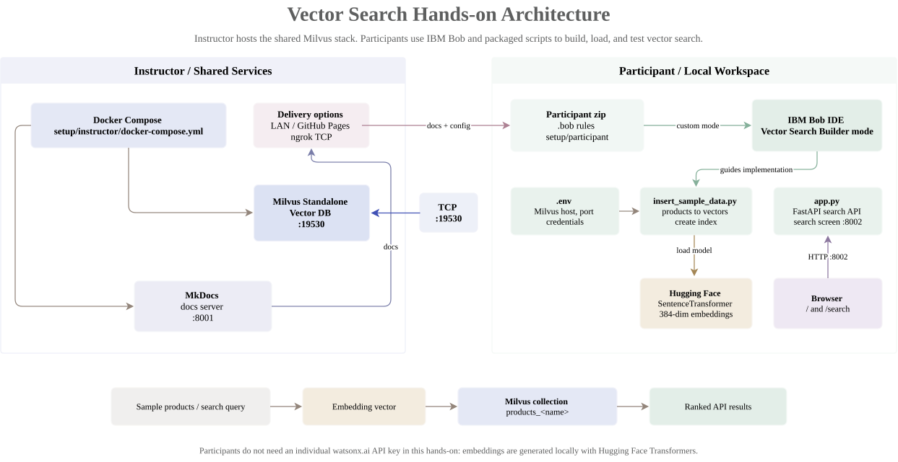

# Vector Search Hands-on

[](https://github.com/mukoubuchi/vector-search-hands-on/actions/workflows/ci.yml)
[](https://github.com/mukoubuchi/vector-search-hands-on/actions/workflows/e2e-smoke.yml)
[](https://mukoubuchi.github.io/vector-search-hands-on/)
[](https://github.com/mukoubuchi/vector-search-hands-on/releases/latest)
[](LICENSE)


A 60-minute hands-on that builds keyword, vector and hybrid search over one **OpenSearch** index with **IBM watsonx.ai** embeddings, driven by **IBM Bob** running the Building Block IBM publishes for this job.

## What This Is

A FastAPI service with a single `/search` endpoint and a `mode` parameter:

| Mode | Ranking |
|:---|:---|
| `keyword` | BM25 over the analysed product text |
| `vector` | k-NN over 768-dimension watsonx.ai embeddings |
| `hybrid` | Both rankings, min-max normalised and blended by a caller-supplied weight |

One index serves all three, so a participant can watch the same question produce different answers and see which side produced each hit.

## How This Differs from the Existing DSCE Assets

- **A kit, not a demonstration.** One repository, one container, one set of credentials, reproducible by anyone.
- **The Building Block is the subject.** The mode and the skill are shipped as IBM publishes them, not rewritten for the workshop.
- **The comparison is the lesson.** Keyword, vector and hybrid answer the same questions over the same index.
- **The smallest useful system.** Retrieval only — no object storage ingestion, no chunking, no generation — so the moving parts stay visible.

The Digital Self-Serve Co-Create Experience (DSCE) catalogue shows finished solutions to specific problems — Orbital Suppliers, NexusIQ and Maximo Knowledge Hub among them. This one shows the mechanism and hands it over.

## The Building Block

**OpenSearch Vector Search Builder** — an IBM Bob custom mode plus a skill, taken from [ibm-self-serve-assets/building-blocks](https://github.com/ibm-self-serve-assets/building-blocks) at commit `4a2ee334bf0acb4a798dc197e6f63bde99b9a0d6`:

| Shipped file | Upstream archive |
|:---|:---|
| `.bob/custom_modes.yaml`, `.bob/rules-opensearch-builder/*.xml` | `data/pipelines/rag/bob-modes/base-modes/opensearch-builder.zip` (blob `efa9473d0146246c08a3ef9351f882b0b7a58e02`) |
| `.bob/skills/opensearch-vector-search/SKILL.md` | `data/pipelines/rag/bob-skills/opensearch-vector-search.zip` (blob `916e1f974f3a420006f76335bff14e5c3d64c9ae`) |

Everything is byte-identical to upstream except one line of `custom_modes.yaml`. Upstream writes

```yaml
    name: >- OpenSearch Vector Search Builder
```

which is not valid YAML — a block scalar indicator must end its line — so PyYAML, Ruby's Psych, the npm `yaml` package and `js-yaml` all reject the file at line 3. We did not test the unmodified file in IBM Bob; the kit ships the corrected line so that the mode loads without depending on how Bob's parser treats the malformed one. The shipped copy reads

```yaml
    name: OpenSearch Vector Search Builder
```

`lib/check_upstream_building_blocks.sh` re-downloads both archives at the pinned commit, verifies their blob ids, applies that one line and diffs the result against what the repository ships. CI runs it on every build, so any upstream drift fails loudly.

## IBM Bob

Every Bob step in the documentation is written for the **IBM Bob IDE** (desktop application), version **2.1.0**. IBM also ships **Bob shell**, a command-line product on its own release line with its own version number; this hands-on does not cover it.

## Architecture



## Quick Start

### For Instructors

#### Ports

| Service | Port | URL | Purpose |
|---------|--------|-----|------|
| **MkDocs (development)** | 8000 | <http://localhost:8000> | Document editing (auto-reload) |
| **MkDocs (container)** | 8001 | <http://localhost:8001> | Participant sharing |
| **FastAPI (Swagger UI)** | 8002 | <http://localhost:8002/docs> | The search API participants build |
| **OpenSearch** | 9200 | <https://localhost:9200> | Search engine (HTTPS, self-signed) |

#### Start the Environment

```bash
cd setup/instructor
./start-all.sh
```

`start-all.sh` generates the OpenSearch admin password on first start, stores it in `setup/instructor/.env`, waits for the cluster to report healthy, confirms the k-NN plugin, and prints what to share with participants. The container runtime is Colima or Podman; Docker Desktop is not used.

#### Remote Delivery

Publish the documentation with GitHub Pages, and reach OpenSearch over **a private network (Tailscale, VPN) or an organisation-approved cloud endpoint**.

```bash
# 1. Publish the documentation
#    Settings -> Pages -> Source: "GitHub Actions"
#    https://mukoubuchi.github.io/vector-search-hands-on/

# 2. Share with participants
#    - OpenSearch host: the instructor's private-network address, port 9200
#    - OpenSearch password: printed by start-all.sh
```

> **Fallback: `ngrok tcp 9200`.** OpenSearch serves HTTPS, so a tunnel does not expose the password in cleartext the way a plain-TCP database protocol would. It is still a fallback: participants connect with certificate verification disabled (the cluster's certificate is self-signed), so the connection is encrypted but not authenticated, and anyone with the hostname and password can reach the cluster. Stop the tunnel when the session ends.

> **Network note**: corporate VPNs and DNS security products such as Cisco Umbrella may block ngrok tunnels or break its hostname resolution. If participants cannot connect, use a same-network, private-network or cloud VM alternative.

#### Local Delivery (same network)

```bash
cd setup/instructor
./start-all.sh
ifconfig | grep "inet " | grep -v 127.0.0.1

# Share:
#  - OpenSearch: <IP address>:9200 (admin / the password printed by start-all.sh)
#  - Documentation: http://<IP address>:8001
```

#### Stop

```bash
cd setup/instructor
./stop-all.sh
```

Details: [setup/instructor/deploy-docs-to-cloud.md](setup/instructor/deploy-docs-to-cloud.md)

### For Participants

Distributed packages (from the [latest release assets](https://github.com/mukoubuchi/vector-search-hands-on/releases/latest), or built with `./setup/instructor/build-participant-zips.sh`):

- `opensearch-vector-search-en.zip` — English rules, sample data and scripts
- `opensearch-vector-search-ja.zip` — Japanese rules, sample data and scripts（日本語版）

Both contain the same scripts; each carries the sample data and `.env.example` for its language. Instructor files, documentation, local `.env` files and caches are excluded.

1. Unzip into a working folder — this also installs the Building Block, since `.bob/` lands at the folder root.
2. Open that folder in IBM Bob IDE and trust it when the Restricted Mode banner asks — Bob stays hidden until you do.
3. Create `setup/participant/.env` from `.env.example` and fill in the OpenSearch connection details, your IBM Cloud API key and watsonx.ai project ID, and an `INDEX_NAME` unique to you — the cluster is shared.
4. Select the **OpenSearch Vector Search Builder** mode.
5. `pip install -r setup/participant/requirements.txt`, then `python test_connection.py`.

Details: [docs/preparation.md](docs/preparation.md)

## Hands-on Flow

| Part | Content | Time |
|-------|------|---------|
| [Preparation](docs/preparation.md) | Install the Building Block, configure credentials | 15 min |
| [Part 1](docs/part1.md) | Run keyword, vector and hybrid search | 20 min |
| [Part 2](docs/part2.md) | Add features by instructing IBM Bob | 20 min |
| [Summary](docs/summary.md) | Review, production path, clean-up | 5 min |

Japanese documentation: [docs/ja/](docs/ja/)

## Requirements

- IBM Bob IDE 2.1.0
- Python 3.11 – 3.14 (`ibm-watsonx-ai` declares `>=3.11,<3.15`)
- An IBM Cloud API key and a watsonx.ai project ID
- A container runtime (Colima or Podman) — instructors, and anyone running the cluster themselves

## Tech Stack

- **Building Block**: OpenSearch Vector Search Builder (IBM Bob custom mode and skill)
- **AI development assistant**: IBM Bob IDE 2.1.0
- **Search engine**: OpenSearch 3.8.0 with the k-NN plugin (opensearch-py 3.2)
- **Embeddings**: IBM watsonx.ai, `ibm/granite-embedding-278m-multilingual` (768 dimensions, ibm-watsonx-ai 1.7)
- **Web framework**: FastAPI 0.141 / Uvicorn
- **Documentation**: MkDocs Material with the i18n plugin (English / 日本語)
- **CI/CD**: GitHub Actions — lint, upstream provenance check, zip packaging, docs deploy, translation sync, E2E smoke test

## Directory Structure

```
vector-search-hands-on/
├── .github/
│   ├── dependabot.yml                     # Automated dependency updates
│   └── workflows/
│       ├── ci.yml                         # Lint, upstream check, zip build, docs build
│       ├── deploy-docs.yml                # GitHub Pages auto-deploy
│       ├── e2e-smoke.yml                  # Full-stack smoke test (skipped without watsonx.ai secrets)
│       ├── release.yml                    # Attach participant zips to releases
│       ├── sync-translations.yml          # Translation sync check (EN -> JA)
│       └── sync-translations-ja-to-en.yml # Translation sync check (JA -> EN)
├── docs/                                  # Hands-on documentation (MkDocs)
│   ├── index.md  preparation.md  part1.md  part2.md  summary.md
│   ├── translation-sync.md                # Internal guide (excluded from the nav)
│   ├── readme.md                          # docs/ directory structure guide
│   ├── ja/                                # Japanese translations of the above
│   ├── images/                            # Diagrams (EN/JA where needed)
│   ├── javascripts/                       # Custom JavaScript
│   └── stylesheets/                       # Custom CSS
├── setup/
│   ├── instructor/
│   │   ├── docker-compose.yml             # OpenSearch node and docs container
│   │   ├── mkdocs.Dockerfile              # Docs container image (pinned plugins)
│   │   ├── .env.example                   # Environment variable template
│   │   ├── start-all.sh                   # Start services, generate the admin password
│   │   ├── stop-all.sh                    # Stop services and the demo on port 8002
│   │   ├── build-participant-zips.sh      # Rebuild the participant packages
│   │   ├── deploy-docs-to-cloud.md        # Document delivery methods
│   │   └── instructor-share-info.md       # What to share with participants
│   └── participant/
│       ├── .bob/                          # The Building Block, as shipped by IBM
│       │   ├── custom_modes.yaml          # OpenSearch Vector Search Builder mode
│       │   ├── rules-opensearch-builder/  # Workflow and best-practice rules
│       │   └── skills/opensearch-vector-search/SKILL.md
│       ├── .env.example.en                # English connection template
│       ├── .env.example.ja                # Japanese connection template
│       ├── requirements.txt               # Python dependencies
│       ├── common.py                      # Environment, language, OpenSearch and watsonx.ai helpers
│       ├── index_mapping.py               # k-NN index definition and field settings
│       ├── app.py                         # FastAPI search application (keyword/vector/hybrid)
│       ├── insert_sample_data.py          # Index creation and sample data loader
│       ├── sample_products.py             # Language-aware sample data selector
│       ├── sample_products_en.py          # English sample product data
│       ├── sample_products_ja.py          # Japanese sample product data
│       └── test_connection.py             # OpenSearch and watsonx.ai connection test
├── lib/
│   ├── common.sh                          # Shared shell functions
│   ├── check_translation_sync.sh          # Translation sync checker
│   ├── check_upstream_building_blocks.sh  # Upstream provenance check
│   └── upstream-building-blocks.sh        # Pinned upstream commit, blob ids, recorded fix
├── LICENSE                                # Apache-2.0
├── mkdocs.yml                             # MkDocs configuration
└── README.md                              # This file
```

The participant zips are not committed: the release workflow builds them from these sources and attaches them to every GitHub release, and CI builds them on every push so the packaging script cannot rot.

## Support

Questions about the hands-on: open an issue on this repository.

## License

Apache-2.0. See [LICENSE](LICENSE).
