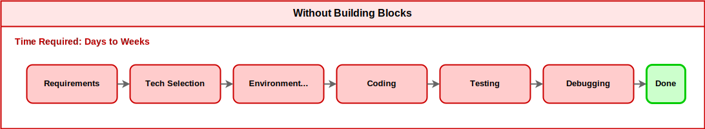

# Welcome to Vector Search Hands-on

In this hands-on workshop, you will combine **Building Blocks** and **IBM Bob** to experience AI-driven development for building a "semantic search" feature (Vector Search).

!!! info "Prerequisites"
    
    IBM Bob is already installed and available for use.
    This hands-on uses **IBM Bob 1.0.3**.

## What You'll Experience in This Hands-on

### Value of Building Blocks + IBM Bob

This hands-on workshop demonstrates how combining **Building Blocks** (pre-built technical components) with **IBM Bob** (an AI development assistant) can complete development that would typically take days to weeks in **approximately 90 minutes**.

**Without Building Blocks (Time required: days to weeks):**

Without Building Blocks, the following work is required:

- Vector database selection and learning
- Embedding model selection and integration
- API design and implementation
- Error handling
- Performance tuning

**With Building Blocks + IBM Bob (This hands-on, Time required: approximately 90 minutes):**

Responsibilities for each process:

- **Building Blocks**:
    - Technology selection (Milvus, embedding models)
    - Environment setup support (Bob mode, API samples)
- **IBM Bob**:
    - Requirements definition
    - Coding
    - Testing
    - Debugging

??? note "About IBM Bob's Coverage"
    IBM Bob can support the entire Software Development Lifecycle (SDLC) as an AI SDLC partner, from requirements definition to debugging. In this hands-on, Building Blocks provides technology selection (Milvus, embedding models) and environment setup support (Milvus setup, Bob mode), and the instructor prepares the Milvus environment in advance with Docker Compose, so IBM Bob focuses mainly on coding, testing, and debugging. However, if you use Plan mode, you can also utilize it in the requirements definition and design stages.

## What are Building Blocks?

**Building Blocks** are **pre-built technical components** leveraging IBM's technology stack. Using Building Blocks accelerates solution development.

### Features of Building Blocks

- **Ready to use**: Start using immediately without complex configuration or learning
- **Best practices**: Optimal implementation patterns designed by IBM's engineering team
- **Domain-specific**: Provides Vector Search-specific guidance and implementation patterns
- **Customizable**: Flexibly extend to meet business requirements using IBM Bob

### Building Block Used in This Hands-on

**Vector Search Builder** (Milvus-based)

**What it provides**: Vector database (Milvus) construction and management capabilities

**Included features**:

- Milvus database setup
- Collection (data container) creation
- Local embedding model integration with Hugging Face Transformers
- Sample product data ingestion workflow
- Vector search optimization

**Integration with IBM Bob**: Using Vector Search Builder mode, IBM Bob provides specialized support for Vector Search

!!! example "Value of Building Blocks"
    
    **Without Building Blocks**: Read Milvus documentation, learn Python SDK, select and integrate embedding models (days)

    **With Building Blocks**: Install Vector Search Builder and instruct IBM Bob (minutes)

??? info "Unique Innovations in This Hands-on"
    File and directory paths in this section are relative to the following GitHub repository.

    - **Repository**: [mukoubuchi/vector-search-hands-on](https://github.com/mukoubuchi/vector-search-hands-on)

    ### What Building Blocks Provide
    
    Building Blocks provide the following technical components:
    
    1. **Vector Search Builder Mode**
        - **Participant package**: `vector-search-builder-en.zip`
        - **Contents**:
            - IBM Bob custom mode configuration
            - 3 Vector Search Builder rule files
            - AI assistant functionality specialized for Vector Search
            - Milvus operation best practices
            - Participant scripts and connection configuration template
        - **Excluded**:
            - Instructor files
            - Documentation files
            - Local `.env` files and generated caches
    ### What This Hands-on Adds
    
    In addition to the Building Blocks foundation, the following have been added for educational purposes:
    
    - **`setup/instructor/`**: Instructor Milvus environment (Docker Compose)
    - **`setup/participant/`**: Participant connection test scripts
    - **`docs/`**: Hands-on documentation (MkDocs)
    
    ### 1. Instructor-Participant Separation Architecture
    
    Building Blocks alone:
    
    - Each person builds their own Milvus environment (Docker/Podman/Colima)
    - Individually download embedding models (approximately 200 MB)
    - Environment setup takes about 30 minutes
    
    This hands-on's innovation:

    - **Instructor**: Centrally manages Milvus environment (`setup/instructor/docker-compose.yml`)
    - **Participants**: Participate with IBM Bob, `.bob/custom_modes.yaml`, `.bob/rules-vector-search-builder/`, participant scripts, and connection information only
    
    **2. Hybrid Delivery Support**
    
    Building Blocks alone:
    
    - Assumes local environment execution
    
    This hands-on's innovation:

    - **On-site**: Local network sharing (`http://instructor IP:8001`)
    - **Remote**: Document delivery via GitHub Pages or ngrok
    
    **3. API Key-Free Design**
    
    Building Blocks alone:
    
- Cloud-based embedding options often require API keys
- Participants configure credentials individually
    
    This hands-on's innovation:

    - **Hugging Face Transformers** used (no API key required)
    - **Local execution**: Works with internet connection only
    
    **4. Progressive Learning Path**
    
    Building Blocks alone:
    
    - Focuses on technical implementation
    
    This hands-on's innovation:

    - **Part 1**: Experience Vector Search (understanding)
    - **Part 2**: Add features with IBM Bob (practice)
    - **Part 3**: Code review and improvement (application)
    
    ### Summary of Role Division
    
    | Provider | What's Provided | Purpose |
    |:---|:---|:---|
    | **Building Blocks** | Vector Search Builder mode FastAPI sample Milvus setup guide | Technology foundation provision Development acceleration |
    | **This Hands-on** | Instructor environment (Docker Compose) Participant scripts Educational documentation | Educational design Learning experience optimization |
    
    !!! success "Benefits of This Hands-on"
        **Building Blocks (technology foundation)** + **Hands-on unique innovations (educational design)** = **High learning effectiveness in a short time**
        
        - **Setup time reduction**: 30 minutes → 5 minutes (instructor centrally manages environment)
        - **No API key required**: Using Hugging Face reduces participant preparation burden
        - **Flexible delivery format**: Supports on-site/remote/hybrid delivery
        - **Progressive learning**: Even beginners can progress from understanding → practice → application

## What is IBM Bob?

**IBM Bob** is a development tool where AI assists with coding.

### What IBM Bob Can Do

- **Natural language instructions**: Communicate what you want to do in words
- **Automatic code generation**: Automatically writes high-quality code
- **Code review**: Points out code issues
- **Integration with Building Blocks**: Provides technology-specific support through custom modes

### Synergy with Building Blocks

**Building Blocks alone**:

- Basic functionality is provided, but customization requires technical knowledge

**IBM Bob alone**:

- Code generation is possible, but building from scratch takes time

**Building Blocks + IBM Bob**:

- Building Blocks instantly builds the foundation
- IBM Bob customizes with natural language instructions only
- **Result**: Achieve production-level quality in the shortest time

### Comparison of Development Methods

| Development Method | Time Required | Required Skills | Code Quality |
|:---|---:|:---|:---|
| **Without Building Blocks** | Days to weeks | Programming, DB design, API design | Depends on developer skills |
| **IBM Bob only** | Hours to days | Basic technical understanding | High quality but time-consuming to build |
| **Building Blocks + IBM Bob** | Minutes to hours | Just need to instruct in natural language | Production-level high quality |

## What is Vector Search?

**Vector Search** is a technology that searches by understanding the "meaning" of words.

### Difference from Traditional Search

**Traditional keyword search**:

- "red sneakers" → Searches for products containing the **characters** "red" and "sneakers"
- "red running shoes" won't be found (different characters)

**Vector Search (semantic search)**:

- "red sneakers" → Understands the **meaning** of "red" and "sneakers"
- "red running shoes" will be found (similar meaning)
- "beginner camera" → "entry-level digital camera" will be found

### Real-world Use Cases

- **E-commerce sites**: "Find similar products" feature
- **Internal search**: "Find documents similar to this document"
- **Customer support**: "Find similar questions"

## Hands-on Flow

**Total**: Approximately 90 minutes

| Part | Content | Time Required |
|:---|:---|---:|
| [Preparation](preparation.md) | Vector Search Builder setup | 15 minutes |
| [Part 1](part1.md) | Experience Vector Search | 20 minutes |
| [Part 2](part2.md) | Add features with IBM Bob | 30 minutes |
| [Part 3](part3.md) | Verification | 15 minutes |
| [Summary](summary.md) | Review and Q&A | 10 minutes |

??? info "About This Hands-on's Documentation Design"
    
    ### Why Manual Methods Differ Between First and Second Half
    
    In this hands-on, **the first half (preparation, Part 1) describes both IBM Bob delegation and manual execution methods**, but **the second half (Part 2-3) describes only IBM Bob delegation methods**. This is for the following reasons:
    
    **1. Complexity and Length of Manual Work**
    
    - **First half work**: Simple command execution (`pip install -r requirements.txt`, `python test_connection.py`), can be completed in one line manually
    - **Second half work**: Editing multiple files such as `app.py`, `schema.py`, data insertion scripts, and sample product data; changing data models, response structures, error handling, etc.; requiring dozens to hundreds of lines of code changes. Manual description would be very long and complex, making the documentation enormous
    
    **2. Educational Intent**
    
    - **First half**: Show **options** that "can be done with IBM Bob or manually"
    - **Second half**: Let users **experience the value** that "what's difficult manually is easy with IBM Bob"
    
    ??? example "Experience the Value of Building Blocks + IBM Bob"
        In particular, the experience of [**completing complex code changes with a short instruction to add an `image_url` field to the `/search` API JSON response**](part2.md#feature-1-product-image-display) is designed to **most effectively convey the value of Building Blocks + IBM Bob**.
        
        **Why This Instruction is Most Effective**:
        
        **Building Blocks Effect**:
        
        - **Vector Search knowledge**: IBM Bob understands Milvus, embedding models, and vector search best practices through Vector Search Builder mode
        - **Existing foundation**: Sample data, API structure, shared schema definitions, and data models are already prepared, and IBM Bob can add features using them
        - **No technology selection needed**: Technology selection for Milvus, embedding models, API design, etc. is complete, and IBM Bob can focus on implementation
        
        **IBM Bob Effect**:
        
        - **Natural language instructions**: Just one line in natural language, without any technical details
        - **Automatic code generation**: Automatically executes editing of multiple files, schema/data model changes, response structure changes
        - **Immediate results**: Can verify operation immediately after instruction, getting the feeling that "it really worked"
        
        **Synergy of IBM Bob and Building Blocks**:
        
        - **First experience in Part 2**: The moment participants "add a feature themselves" for the first time, making it memorable
        - **Contrast with other instructions**: Price filters and recommendation reasons are similarly easy, but this first experience is most impactful
        - **Gap with complexity**: Work that would take days without Building Blocks is completed with one IBM Bob instruction
    
    **3. Building Blocks Value Proposition**
    
    - Let users experience the time reduction effect of "days to weeks → approximately 90 minutes"
    - Emphasize this effect by omitting manual methods in the second half
    
    **4. Consideration for Time Constraints**
    
    - Designed for approximately 90 minutes total
    - Just reading detailed manual methods would run out of time
    - Focusing on IBM Bob delegation **secures time for actual hands-on work**
    
    **5. Complexity of Error Handling**
    
    When manually changing code, troubleshooting for syntax errors, indentation errors, type errors, logic errors, etc. is necessary. Describing all of these would make the documentation several times longer
    
    **6. Progressive Learning Design**
    
    - **First half**: Get familiar with using IBM Bob through simple tasks
    - **Second half**: Experience IBM Bob's true value through complex tasks
    
    This design allows participants to naturally understand IBM Bob's value and acquire practical skills.

## Requirements

- **Computer** (Mac, Windows) and internet connection
- **IBM Bob** (already installed)
- **Web browser** (Chrome, Firefox, Safari, Edge, etc.)

**Distributed by instructor**:

- Hands-on procedure URL
- Minimal Vector Search Builder participant package (`vector-search-builder-en.zip`)
- Connection information (Milvus connection information)

## Next Steps

Let's proceed to the [Preparation](preparation.md) page!
