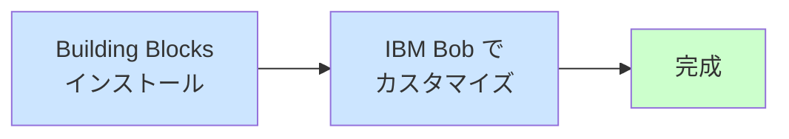

# Vector Search ハンズオンへようこそ

このハンズオンでは、**IBM Building Blocks** と **IBM Bob** を組み合わせて、「意味で検索する」機能（Vector Search）を短時間で構築・体験します。

!!! info "前提条件"
    IBM Bob が既にインストールされ、使用できる状況を前提としています（プラン：IBM Internal Version）。

## このハンズオンで体験できること

### Building Blocks + IBM Bob の価値

このハンズオンでは、**IBM Building Blocks** という事前構築済みの技術コンポーネントと、**IBM Bob** という AI 開発アシスタントを組み合わせることで、数日〜数週間かかる開発を **約 60 分** で完了できることを体験します。

#### Building Blocks なしの場合

**所要時間**: 数日〜数週間

- ベクトルデータベースの選定・学習
- 埋め込みモデルの選定・統合
- API の設計・実装
- エラーハンドリング
- パフォーマンスチューニング

#### Building Blocks + IBM Bob の場合（このハンズオン）

**所要時間**: 約 60 分

- **Building Blocks**: Vector Search Builder モードで基盤を即座に構築
- **IBM Bob**: 自然言語の指示だけで機能追加・カスタマイズ
- **結果**: 本番レベルのコード品質を短時間で実現

## IBM Building Blocks とは？

**IBM Building Blocks** は、IBM の技術スタックを活用した **事前構築済みの技術コンポーネント** です。Building Blocks を活用することでソリューション開発を加速させることができます。

### Building Blocks の特徴

- **即座に使える**: 複雑な設定や学習なしに、すぐに使い始められる
- **ベストプラクティス**: IBM のエンジニアリングチームが設計した最適な実装パターン
- **統合済み**: watsonx.ai、watsonx.data などの IBM サービスとシームレスに連携
- **カスタマイズ可能**: IBM Bob を使って、ビジネス要件に合わせて柔軟に拡張

### このハンズオンで使用する Building Block

**Vector Search Builder** (Milvus ベース)

**提供内容**: ベクトルデータベース（Milvus）の構築・管理機能

**含まれる機能**:

- Milvus データベースのセットアップ
- コレクション（データの入れ物）の作成
- 埋め込みモデルの統合（watsonx、HuggingFace、ローカル）
- データ取り込みパイプライン
- ベクトル検索の最適化
- IBM Cloud Object Storage との連携

**IBM Bob との連携**: Vector Search Builder モードを使うことで、IBM Bob が Vector Search に特化した支援を提供

!!! example "Building Blocks の価値"
    **Building Blocks なし**: Milvus のドキュメントを読み、Python SDK を学習し、埋め込みモデルを選定・統合（数日）
    
    **Building Blocks あり**: Vector Search Builder をインストールし、IBM Bob に指示（数分）

??? info "このハンズオンの独自の工夫"
    **Building Blocks が提供するもの**:
    
    - **`.bob/modes/`**: Vector Search Builder モード定義（zipファイル）
    - 各自がローカル環境で Milvus を構築して使用
    
    **このハンズオンで追加したもの**:
    
    - **`setup/instructor/`**: 講師用Milvus環境（Docker Compose）
    - **`setup/participant/`**: 受講者用接続テストスクリプト
    - **`docs/`**: ハンズオン用ドキュメント（MkDocs）
    - **`deploy-to-code-engine.sh`**: リモート配信用デプロイスクリプト
    
    #### 1. **講師・受講者分離アーキテクチャ**
    
    **Building Blocks 単体**:
    
    - 各自が Milvus 環境を構築（Docker/Podman/Colima）
    - 個別に埋め込みモデルをダウンロード（約 200 MB）
    - 環境構築に 30 分程度必要
    
    **このハンズオンの工夫**:
    
    - **講師**: Milvus 環境を一元管理（`setup/instructor/docker-compose.yml`）
    - **受講者**: IBM Bob のみで参加（`.bob/modes/` + 接続情報のみ）
    
    #### 2. **ハイブリッド配信対応**
    
    **Building Blocks 単体**:
    
    - ローカル環境での実行を想定
    
    **このハンズオンの工夫**:
    
    - **オンサイト**: ローカルネットワーク共有（`http://講師IP:8001`）
    - **リモート**: Code Engine へのドキュメントデプロイ
    
    #### 3. **API キー不要の設計**
    
    **Building Blocks 単体**:
    
    - watsonx.ai の API キーが必要
    - 受講者が個別に取得・設定
    
    **このハンズオンの工夫**:
    
    - **Hugging Face Transformers** を使用（API キー不要）
    - **ローカル実行**: インターネット接続のみで動作
    
    #### 4. **段階的な学習パス**
    
    **Building Blocks 単体**:
    
    - 技術的な実装に焦点
    
    **このハンズオンの工夫**:
    
    - **Part 1**: Vector Search の体験（理解）
    - **Part 2**: IBM Bob での機能追加（実践）
    - **Part 3**: コードレビューと改善（応用）
    
    !!! success "このハンズオンのメリット"
        **Building Blocks（基盤）** + **ハンズオン独自の工夫（教育設計）** = **短時間で高い学習効果**
        
        - **セットアップ時間の短縮**: 30 分→ 5 分（講師が環境を一元管理）
        - **API キー不要**: Hugging Face 使用で受講者の準備負担を削減
        - **柔軟な開催形式**: オンサイト/リモート/ハイブリッド開催に対応
        - **段階的な学習**: 初心者でも理解→実践→応用と進められる

## IBM Bob とは？

**IBM Bob** は、AI がコーディングをサポートしてくれる開発ツールです。

### IBM Bob でできること

- **自然言語で指示**: やりたいことを言葉で伝えられる
- **コードを自動生成**: 高品質なコードを自動的に書いてくれる
- **コードレビュー**: コードの問題点を指摘してくれる
- **Building Blocks との連携**: カスタムモードで、技術に特化した支援を提供

### Building Blocks との相乗効果

**Building Blocks 単体**:

- 基盤となる機能は提供されるが、カスタマイズには技術知識が必要

**IBM Bob 単体**:

- コード生成は可能だが、ゼロから構築するため時間がかかる

**Building Blocks + IBM Bob**:

- Building Blocks で基盤を即座に構築
- IBM Bob で自然言語指示だけでカスタマイズ
- **結果**: 最短時間で本番レベルの品質を実現

### 開発方法の比較

| 開発方法 | 所要時間 | 必要なスキル | コード品質 |
|:---|---:|:---|:---|
| **Building Blocks なし** | 数日〜数週間 | プログラミング、DB 設計、API 設計 | 開発者のスキルに依存 |
| **IBM Bob のみ** | 数時間〜数日 | 基本的な技術理解 | 高品質だが構築に時間 |
| **Building Blocks + IBM Bob** | 数分〜数時間 | 自然言語で指示できれば OK | 本番レベルの高品質 |

## Vector Search とは？

**Vector Search（ベクトル検索）** は、言葉の「意味」を理解して検索する技術です。

### 従来の検索との違い

**従来のキーワード検索**:

- 「赤いスニーカー」→「赤い」と「スニーカー」という**文字**が含まれる商品を探す
- 「赤色のランニングシューズ」は見つからない（文字が違うため）

**Vector Search（意味で検索）**:

- 「赤いスニーカー」→「赤い」「スニーカー」の**意味**を理解
- 「赤色のランニングシューズ」も見つかる（意味が似ているため）
- 「初心者向けカメラ」→「入門用デジタルカメラ」も見つかる

### 実際の活用例

- **EC サイト**: 「似た商品を探す」機能
- **社内検索**: 「この資料に似た文書を探す」
- **カスタマーサポート**: 「似た質問を探す」

## ハンズオンの流れ

**合計**: 約 60 分

| パート | 内容 | 所要時間 |
|:---|:---|---:|
| [事前準備](preparation.md) | Vector Search Builder のセットアップ | 10 分 |
| [Part 1](part1.md) | Vector Search を体験 | 15 分 |
| [Part 2](part2.md) | IBM Bob で機能を追加 | 20 分 |
| [Part 3](part3.md) | 動作確認 | 15 分 |

## 必要なもの

- **パソコン**（Mac、Windows）とインターネット接続
- **IBM Bob**（既にインストール済み）
- **Web ブラウザ**（Chrome、Firefox、Safari、Edge など）

**講師から配布**:

- ハンズオン手順書の URL
- Vector Search Builder（zip ファイル）
- 接続情報（Milvus 接続情報）

## 次のステップ

それでは、[事前準備](preparation.md) のページに進みましょう！

事前準備では、Vector Search Builder のセットアップを行います。
