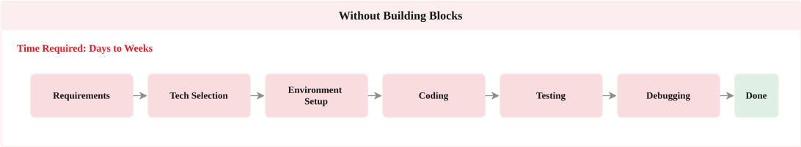

# Welcome to Vector Search Hands-on

In this hands-on workshop you build a product search API that answers the same question three ways (keyword, vector and hybrid) on one **OpenSearch** index, with **IBM watsonx.ai** embeddings, and you let **IBM Bob** do the work from a **Building Block** that already knows how OpenSearch vector search is put together.

!!! info "Prerequisites"

    IBM Bob is already installed. This hands-on uses the **IBM Bob IDE** (desktop application), version **2.1.0**, and every step is written for it.

    IBM also ships **Bob shell**, a command-line product on its own release line with its own version number. This hands-on does not cover it.

## What You'll Build

A FastAPI service with one `/search` endpoint and a `mode` parameter:

| Mode | How it ranks | Finds "red running shoes" when you ask for "red sneakers"? |
|:---|:---|:---|
| `keyword` | BM25 over the product text | Only if the words match |
| `vector` | k-NN over watsonx.ai embeddings | Yes, it matches on meaning |
| `hybrid` | Both, normalised and blended | Yes, and exact wording still counts |

The three modes share one index, so the difference you see comes from the query, not from different data.

## Hands-on Flow

**Total**: Approximately 60 minutes

| Part | Content | Time Required |
|:---|:---|---:|
| [Preparation](preparation.md) | Install the Building Block, configure credentials | 15 minutes |
| [Part 1](part1.md) | Run keyword, vector and hybrid search | 20 minutes |
| [Part 2](part2.md) | Add features by instructing IBM Bob | 20 minutes |
| [Summary](summary.md) | Review, production path, clean-up | 5 minutes |

## What are Building Blocks?

**Building Blocks** are pre-built technical components from IBM's technology stack. This hands-on uses one of them, exactly as IBM publishes it:

**OpenSearch Vector Search Builder** is an IBM Bob custom mode plus a skill, from [ibm-self-serve-assets/building-blocks](https://github.com/ibm-self-serve-assets/building-blocks).

**What it provides**:

- A Bob persona that knows k-NN index design, HNSW parameters, `knn_vector` mappings and hybrid score normalisation
- A workflow for going from an empty cluster to a working hybrid search
- Guidance to use IBM watsonx.ai for embeddings, and not to invent endpoints or model availability

**How it is shipped here**: the mode, its rules and the skill are the upstream files, byte for byte, apart from one line that upstream wrote as invalid YAML. [Preparation](preparation.md#what-the-building-block-contains) records the commit, the blob ids and the exact change, and a CI check re-downloads the upstream files on every build to prove nothing else drifted.

## Value of Building Blocks + IBM Bob

Building the retrieval layer of a semantic search feature is mostly decisions: which engine, which embedding model, how to blend two rankings. A Building Block arrives with those decisions already made.

**Without Building Blocks**

You read the OpenSearch k-NN documentation, choose an engine and a space type, work out which watsonx.ai models exist and what dimension they return, and meet the score normalisation problem the first time a hybrid query ranks badly.

**With Building Blocks + IBM Bob**

You unzip the mode, describe the feature you want, and review what IBM Bob proposes. The decisions come with the Building Block, so your attention goes to whether the result is right.

!!! note "About the times in the diagrams"

    They describe building a feature like this one, not this workshop. The hands-on itself takes about 60 minutes because the products, the questions and the cluster are ready for you.

## What is Vector Search?

Keyword search matches characters. Vector search matches meaning.

Every product description is turned into a list of numbers, a **vector**, by an embedding model. Texts that mean similar things get similar vectors, so "footwear for working out" lands near "running shoes" even though they share no words. OpenSearch stores those vectors in a `knn_vector` field and finds the nearest ones.

Neither approach wins everywhere:

- Keyword search is exact. A part number, a brand, a colour spelled the way the shopper spelled it: BM25 nails it and a vector search may drift.
- Vector search is tolerant. A description of what someone wants, with none of the words the catalogue uses: only embeddings will find it.
- **Hybrid** runs both and merges the rankings, which is what production search usually does.

Part 1 has you run all three against the same questions so you can see where each one fails.

## How This Differs from the Existing DSCE Assets

The Digital Self-Serve Co-Create Experience (DSCE) catalogue already has vector search demonstrations: Orbital Suppliers, NexusIQ and Maximo Knowledge Hub among them. This hands-on is a different kind of artefact:

- **It is a kit, not a demonstration.** Everything runs from this repository: one container, a handful of scripts, and credentials you already have. Anyone can reproduce the whole thing on their own machine.
- **The Building Block is the subject.** The mode and skill are shipped unmodified, so what you experience is what IBM publishes, not a variant written for this workshop.
- **The comparison is the lesson.** Keyword, vector and hybrid answer the same questions over the same index, side by side.
- **It stops at the smallest useful system.** No object storage ingestion, no chunking, no generation step: only the retrieval layer, so the moving parts stay visible.

## Requirements

- **Computer** (Mac, Windows) with an internet connection
- **IBM Bob IDE 2.1.0** (already installed)
- **Python 3.11 – 3.14**
- **IBM Cloud API key** and a **watsonx.ai project ID** (for the embeddings)
- **Web browser** (Chrome, Firefox, Safari, Edge)

**Distributed by the instructor**:

- The URL of these instructions
- The participant package (`opensearch-vector-search-en.zip`)
- OpenSearch connection information

!!! tip "Working through this on your own"

    You do not need an instructor. `setup/instructor/start-all.sh` starts the same OpenSearch node on your machine with Colima or Podman, and the rest of the hands-on is identical.

[Next →](preparation.md){ .workshop-next }
