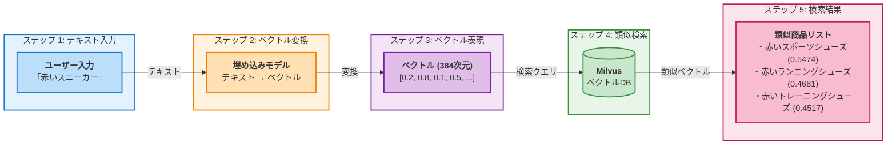

# Part 1: Vector Search を体験しよう

このパートでは、Vector Search（ベクトル検索）がどのように動作するかを実際に体験します。

## このパートのゴール

- Vector Search とは何かを理解する
- 実際に Vector Search を動かしてみる
- 「意味で検索」の便利さを体感する

## ステップ 1: Vector Search とは？

### 従来の検索の問題点

#### 例: EC サイトで商品を探す場合

**あなたの検索**: 「赤いスニーカー」

**従来の検索結果**:

- 「赤いスニーカー」→ 見つかる
- 「赤色のランニングシューズ」→ 見つからない
- 「レッドのスポーツシューズ」→ 見つからない

**なぜ見つからない？**

- 従来の検索は「文字」を探すだけ
- 「赤い」と「赤色」は違う文字として扱われる

### Vector Search の仕組み

Vector Search は「意味」を理解して検索します。以下の図は、このハンズオンで作成するデモアプリにおいて、ユーザー入力をベクトルに変換し、Milvus で類似商品を検索する流れを説明したものです。



!!! info "ポイント"
    - 意味が似ていると、ベクトルも似る
    - コンピュータは数値の類似度を高速計算

**あなたの検索**: 「赤いスニーカー」

**Vector Search の結果**:

- 「赤いスニーカー」→ 見つかる
- 「赤色のランニングシューズ」→ 見つかる（意味が似ている）
- 「レッドのスポーツシューズ」→ 見つかる（意味が似ている）

**なぜ見つかる？**

- Vector Search は「意味」を理解する
- 「赤い」「赤色」「レッド」→ 同じ意味と理解
- 「スニーカー」「ランニングシューズ」「スポーツシューズ」→ 似た意味と理解

### Vector Search の動作

```
ステップ 1: テキストを数値に変換
「赤いスニーカー」→ [0.2, 0.8, 0.1, 0.5, ...] （ベクトル）

ステップ 2: 似た数値を探す
データベースから似た数値のパターンを検索

ステップ 3: 結果を返す
似た意味の商品を返す
```

**ポイント**:

- 「ベクトル」= 数値の配列
- 意味が似ていると、数値のパターンも似る
- コンピュータは数値の類似度を高速に計算できる

## ステップ 2: 接続テストを実行

!!! example "実践: ここから手を動かします"
    
    実際に Vector Search を動かす前に、必要なサービスに接続できるか確認します。

IBM Bob のチャット画面で以下を入力:

```text
Milvus に接続して
```

IBM Bob が自動的にスクリプトを実行し、接続テストを実施します。

??? tip "手動で実行する場合"
    ターミナルに以下を入力:
    
    ```bash
    cd setup/participant
    python test_connection.py
    ```

### 結果を確認

#### 成功の場合

```
==================================================
Milvus 接続テスト
==================================================

=== 環境変数チェック ===
✓ MILVUS_HOST: 192.168.1.100
✓ MILVUS_PORT: 19530
✓ MILVUS_USER: root
✓ MILVUS_PASSWORD: ********

=== Milvus 接続テスト ===
接続先: 192.168.1.100:19530
SSL: 無効
認証: ユーザー名/パスワード認証
✓ Milvus に接続できました
✓ 既存のコレクション数: 0

==================================================
テスト結果
==================================================
Milvus 接続: ✓ 成功

✓ Milvus 接続テストに成功しました
  次のステップ: ベクトル用コレクションを作成
```

接続テスト、サンプルデータ投入スクリプト、デモアプリケーションは同じ `.env` の接続設定を使用します。このテストが成功していれば、以降の手順でも同じ Milvus のホスト、ポート、認証方式が使われます。

#### 失敗の場合

```
✗ Milvus 接続エラー: Connection refused
```

**対処法**:

1. **`.env`** ファイルを確認
    - `MILVUS_HOST` に講師から配布された IP アドレスが正しく入力されているか確認（[:material-cog: 設定方法](preparation.md#milvus_host)）
2. インターネット接続を確認
3. その他のエラーについては、[FAQ](#faq) を参照してください

## ステップ 3: サンプルデータを投入

!!! example "実践: Milvus にサンプルデータを投入"
    
    Vector Search を体験するために、まずサンプル商品データを投入します。

IBM Bob のチャット画面で以下を入力:

```text
サンプルデータを投入して
```

IBM Bob が自動的にスクリプトを実行し、サンプルデータを投入します。

??? tip "手動で実行する場合"
    ターミナルに以下を入力:
    
    ```bash
    # プロジェクトのルートフォルダにいる場合
    cd setup/participant
    python insert_sample_data.py
    ```

    既に `setup/participant` フォルダにいる場合は、`cd setup/participant` は不要です。

### 投入結果を確認

以下のような表示が出れば成功:

```
==================================================
✓ サンプルデータの挿入が完了しました
==================================================

コレクション名: knowledge_base
エンティティ数: 12

デモアプリケーションを起動できます:
  venv/bin/python app.py
==================================================
```

**投入されたデータ**:

- 商品数: 12 件
- カテゴリ: スニーカー、カメラ、パソコン、バッグ
- 各商品に商品名、価格、説明、埋め込みベクトルが含まれる
- コレクション定義と検索対象フィールドはデモアプリケーションと共通化されているため、投入後すぐに検索できます

## ステップ 4: Vector Search を体験

!!! example "実践: Vector Search を動かしてみよう"
    
    サンプルデータの投入が成功したら、実際に Vector Search を体験しましょう。

### デモアプリケーションを起動 {#app-restart}

この手順はターミナルで実行します。事前準備で作成した仮想環境を有効化し、`requirements.txt` のパッケージがインストールされている状態で実行してください。

=== ":fontawesome-brands-apple: Mac"
    ```bash
    cd ~/Desktop/vector-search-builder-ja/setup/participant
    venv/bin/python app.py
    ```

=== ":fontawesome-brands-windows: Windows"
    ```cmd
    cd %USERPROFILE%\Desktop\vector-search-builder-ja\setup\participant
    venv\Scripts\python app.py
    ```

既に `setup/participant` フォルダにいる場合は、`cd ...` の行は不要です。`venv/bin/python app.py` または `venv\Scripts\python app.py` を実行しても、すぐに反応がないように見える場合があります。起動処理に少し時間がかかるため、ターミナルに実行結果が表示されるまでそのまま待ってください。

#### 起動に成功した場合

次のような表示が出れば、アプリケーションは起動しています。

```text
============================================================
✓ アプリケーションを起動しました
============================================================

Swagger UI: http://localhost:8002/docs
============================================================

INFO:     Application startup complete.
```

!!! warning "注意"
    ターミナルを閉じるとアプリケーションが停止します。注意してください。

#### 起動に失敗した場合

`ModuleNotFoundError: No module named 'fastapi'` が表示された場合は、仮想環境に必要なパッケージがインストールされていません。必要なパッケージをインストールしてから（[:material-package-variant-closed: インストール方法](preparation.md#install-packages)）、もう一度デモアプリケーションを起動してください（[:material-play-circle: 起動方法](#app-restart)）。

### 起動を確認

Web ブラウザで以下の URL にアクセスして、Swagger UI が表示されることを確認:

```text
http://localhost:8002/docs
```

**Swagger UI** = API を視覚的にテストできるツール

!!! success "起動成功"
    
    Swagger UI が表示されれば、アプリケーションは正常に起動しています。

### 検索を試してみる

#### ステップ 1: **`/search`** エンドポイントを開く

1. Swagger UI 画面で **`/search`** を探す
2. **`/search`** をクリック

#### ステップ 2: 「Try it out」をクリック

右上の「Try it out」ボタンをクリック

#### ステップ 3: 検索クエリを入力

「Request body」の欄に以下を入力:

```json
{
  "query": "赤いスニーカー"
}
```

#### ステップ 4: 「Execute」をクリック

青い「Execute」ボタンをクリック

#### ステップ 5: 結果を確認

以下のような結果が表示されます（スコアは環境やモデルのバージョンによって多少変わります）:

```json
{
  "results": [
    {
      "product_name": "赤いスポーツシューズ",
      "similarity_score": 0.5474,
      "price": 7500,
      "category": "スニーカー",
      "description": "普段使いにもスポーツにも使える万能シューズ。クッション性に優れています。"
    },
    {
      "product_name": "赤いランニングシューズ",
      "similarity_score": 0.4681,
      "price": 8900,
      "category": "スニーカー",
      "description": "軽量で通気性のよいランニングシューズ。初心者から上級者まで幅広く使えます。"
    },
    {
      "product_name": "赤いトレーニングシューズ",
      "similarity_score": 0.4517,
      "price": 9800,
      "category": "スニーカー",
      "description": "ジムでのトレーニングに最適。安定感とグリップ力が特徴です。"
    }
  ]
}
```

**結果の見方**:

- **`product_name`**: 商品名
- **`similarity_score`**: 類似度（0.0〜1.0、高いほど似ている）
- **`price`**: 価格
- **`category`**: カテゴリ
- **`description`**: 説明

### 色々な検索を試してみる

#### 例 1: 初心者向けの商品を探す

```json
{
  "query": "初心者向けのカメラ"
}
```

#### 例 2: ビジネス向けの商品を探す

```json
{
  "query": "ビジネス向けのノートパソコン"
}
```

#### 例 3: 高性能な商品を探す

```json
{
  "query": "高性能なゲーミング PC"
}
```

### Vector Search の凄さを実感

色々な検索を試すと、以下のことに気づくはずです:

**気づき 1: 言い方が違っても見つかる**

- 「初心者向け」→「入門用」「ビギナー向け」も見つかる

**気づき 2: 類似度スコアが便利**

- スコアが高い = より似ている
- 結果の信頼度が分かる

**気づき 3: 説明文も考慮される**

- 商品名だけでなく、説明文の意味も理解

## Part 1 完了チェック

- [ ] Vector Search とは何かを理解した
- [ ] 従来の検索との違いを理解した
- [ ] 接続テストが成功した
- [ ] サンプルデータを投入できた
- [ ] デモアプリケーションを起動できた
- [ ] Swagger UI を開けた
- [ ] 検索を実行できた
- [ ] 色々な検索を試した

## FAQ

??? question "Q1: Swagger UI が開けない"

    対処法:
    
    1. アプリケーションが起動しているか確認
    2. URL が正しいか確認（**`http://localhost:8002/docs`**）
    3. ブラウザを変えてみる

??? question "Q2: 検索結果が 0 件"

    対処法:
    
    1. サンプルデータが投入されているか確認
    2. 検索クエリを変えてみる

??? question "Q3: 類似度スコアが極端に低い"

    対処法:

    1. 最新の `insert_sample_data.py` でサンプルデータを再投入
    2. デモアプリケーションを手動で再起動
        1. アプリケーションを起動しているターミナルで ++ctrl+c++ （停止）
        2. **`python app.py`** を実行（[:material-play-circle: 起動方法](#app-restart)）
    3. Swagger UI で再度検索

    既存データが古い検索メトリックで作成されている場合、スコアが 0.06 のように低く表示されることがあります。

## 次のステップ

Part 1 が完了したら、[Part 2: IBM Bob で機能を追加](part2.md) に進みましょう！
