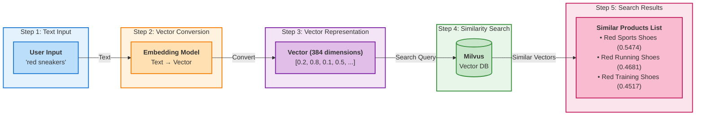

# Part 1: Experience Vector Search

In this part, you'll experience how Vector Search works in practice.

## Goals of This Part

- Understand what Vector Search is
- Actually run Vector Search
- Experience the convenience of "semantic search"

## Step 1: What is Vector Search?

### Problems with Traditional Search

#### Example: Searching for Products on an E-Commerce Site

**Your search**: "red sneakers"

**Traditional search results**:

- "red sneakers" → Found
- "red running shoes" → Not found
- "red sports shoes" → Not found

**Why not found?**

- Traditional search only looks for "characters"
- "red" and "red" (in different forms) are treated as different characters

### How Vector Search Works

Vector Search searches by understanding "meaning".



!!! info "Key Point"
    - Similar meanings result in similar vectors
    - Computers can quickly calculate numerical similarity

**Your search**: "red sneakers"

**Vector Search results**:

- "red sneakers" → Found
- "red running shoes" → Found (similar meaning)
- "red sports shoes" → Found (similar meaning)

**Why found?**

- Vector Search understands "meaning"
- "red" "red" "red" (in various forms) → Understood as the same meaning
- "sneakers" "running shoes" "sports shoes" → Understood as similar meanings

### How Vector Search Operates

```
Step 1: Convert text to numbers
"red sneakers" → [0.2, 0.8, 0.1, 0.5, ...] (vector)

Step 2: Find similar numbers
Search for similar numerical patterns from the database

Step 3: Return results
Return products with similar meanings
```

**Key points**:

- "Vector" = array of numbers
- Similar meanings result in similar numerical patterns
- Computers can quickly calculate numerical similarity

## Step 2: Run Connection Test

!!! example "Practice: Let's get hands-on"
    
    Before running Vector Search, verify that you can connect to the required services.

Enter the following in IBM Bob's chat screen:

```text
Connect to Milvus
```

IBM Bob will automatically run the script and perform the connection test.

??? tip "If Running Manually"
    Enter the following in the terminal:
    
    ```bash
    cd setup/participant
    python test_connection.py
    ```

### Verify Results

#### If Successful

```
==================================================
Milvus Connection Test
==================================================

=== Environment Variable Check ===
✓ MILVUS_HOST: 192.168.1.100
✓ MILVUS_PORT: 19530
✓ MILVUS_USER: root
✓ MILVUS_PASSWORD: ********

=== Milvus Connection Test ===
Connecting to: 192.168.1.100:19530
SSL: disabled
Auth: user/password auth
✓ Connected to Milvus successfully
✓ Existing collections: 0

==================================================
Test Results
==================================================
Milvus connection: ✓ success

✓ Milvus connection test passed!
  Next step: Create vector collection
```

**What is this?**:

- **Milvus**: Vector database (where data is stored)
- **Embedding model**: Converts text to vectors
- **384 dimensions**: Represents meaning with 384 numbers

The connection test, sample data insertion script, and demo application all read the same `.env` connection settings. If this test succeeds, the next steps use the same Milvus host, port, and authentication method.

#### If Failed

```
✗ Milvus connection error: Connection refused
```

**Solution**:

1. Check the **`.env`** file
    - Verify that the IP address distributed by the instructor is correctly entered in `MILVUS_HOST` ([:material-cog: Configuration method](preparation.md#milvus_host))
2. Check internet connection
3. For other errors, refer to [FAQ](#faq)

## Step 3: Insert Sample Data

!!! example "Practice: Insert Sample Data into Milvus"
    
    To experience Vector Search, first insert sample product data.

Enter the following in IBM Bob's chat screen:

```text
Insert sample data
```

IBM Bob will automatically run the script and insert sample data.

??? tip "If Running Manually"
    Enter the following in the terminal:
    
    ```bash
    # If you are in the project root folder
    cd setup/participant
    python insert_sample_data.py
    ```

    If you are already in the `setup/participant` folder, skip `cd setup/participant`.

### Verify Insertion Results

If you see the following display, it's successful:

```
==================================================
✓ Sample data insertion completed
==================================================

Collection name: products_taro  # the unique name you set in .env
Entity count: 12

You can start the demo application:
  venv/bin/python app.py
==================================================
```

**Inserted data**:

- Number of products: 12
- Categories: Sneakers, Cameras, Computers, Bags
- Each product includes product name, price, description, and embedding vector
- The collection schema and search field names are shared with the demo application, so the inserted data is ready to search immediately

## Step 4: Experience Vector Search

!!! example "Practice: Let's run Vector Search"
    
    Once sample data insertion is successful, let's experience Vector Search.

### Launch Demo Application {#app-restart}

Run this step in the terminal.

Run this after activating the virtual environment created during preparation and installing the packages in `requirements.txt`.

=== ":fontawesome-brands-apple: Mac"
    ```bash
    cd ~/Desktop/vector-search-builder-en/setup/participant
    venv/bin/python app.py
    ```

=== ":fontawesome-brands-windows: Windows"
    ```cmd
    cd %USERPROFILE%\Desktop\vector-search-builder-en\setup\participant
    venv\Scripts\python app.py
    ```

If you are already in the `setup/participant` folder, skip the `cd ...` line.

After running `venv/bin/python app.py` or `venv\Scripts\python app.py`, it may look like nothing is happening at first. Startup can take a little time, so wait until the terminal shows the command output.

#### If Launch Succeeds

If you see output like the following, the application is running.

```text
==================================================
✓ Application started successfully
==================================================

Swagger UI: http://localhost:8002/docs
==================================================

INFO:     Application startup complete.
```

!!! warning "Keep the Terminal Open"
    Closing the terminal stops the application. Please be careful.

#### If Launch Fails

If `ModuleNotFoundError: No module named 'fastapi'` appears, the required packages are not installed in the virtual environment. Install the required packages ([:material-package-variant-closed: installation steps](preparation.md#install-packages)), then start the demo application again ([:material-play-circle: launch steps](#app-restart)).

### Verify Launch

Access the following URL in your web browser and verify that Swagger UI is displayed:

```text
http://localhost:8002/docs
```

**Swagger UI** = A tool to visually test APIs

!!! success "Launch Successful"
    
    If Swagger UI is displayed, the application has started successfully.

### Try Searching

#### Step 1: Open the **`/search`** endpoint

1. Find **`/search`** in the Swagger UI screen
2. Click **`/search`**

#### Step 2: Click "Try it out"

Click the "Try it out" button in the upper right

#### Step 3: Enter Search Query

Enter the following in the "Request body" field:

```json
{
  "query": "red sneakers"
}
```

#### Step 4: Click "Execute"

Click the blue "Execute" button

#### Step 5: Verify Results

Results like the following will be displayed. Scores may vary slightly depending on your environment and model version:

```json
{
  "results": [
    {
      "product_name": "Red Sports Shoes",
      "similarity_score": 0.5474,
      "price": 7500,
      "category": "Sneakers",
      "description": "Versatile shoes for both casual and sports use. Excellent cushioning."
    },
    {
      "product_name": "Red Running Shoes",
      "similarity_score": 0.4681,
      "price": 8900,
      "category": "Sneakers",
      "description": "Lightweight and breathable running shoes."
    },
    {
      "product_name": "Red Training Shoes",
      "similarity_score": 0.4517,
      "price": 9800,
      "category": "Sneakers",
      "description": "Ideal for gym training. Features stability and grip."
    }
  ]
}
```

**How to read results**:

- **`product_name`**: Product name
- **`similarity_score`**: Similarity (0.0-1.0, higher is more similar)
- **`price`**: Price
- **`category`**: Category
- **`description`**: Description

### Try Various Searches

#### Example 1: Search for beginner-friendly products

```json
{
  "query": "beginner camera"
}
```

#### Example 2: Search for business-oriented products

```json
{
  "query": "business laptop"
}
```

#### Example 3: Search for high-performance products

```json
{
  "query": "high-performance gaming PC"
}
```

### Experience the Power of Vector Search

As you try various searches, you should notice the following:

**Observation 1: Found even with different phrasing**

- "beginner" → "entry-level" "for beginners" are also found

**Observation 2: Similarity scores are useful**

- Higher score = more similar
- You can see the reliability of results

**Observation 3: Descriptions are also considered**

- Understands not just product names but also the meaning of descriptions

## Part 1 Completion Check

- [ ] Understood what Vector Search is
- [ ] Understood the difference from traditional search
- [ ] Connection test was successful
- [ ] Inserted sample data
- [ ] Launched demo application
- [ ] Opened Swagger UI
- [ ] Executed search
- [ ] Tried various searches

## FAQ

??? question "Q1: Cannot open Swagger UI"

    Solution:
    
    1. Verify the application is running
    2. Verify the URL is correct (**`http://localhost:8002/docs`**)
    3. Try a different browser

??? question "Q2: Search results are 0"

    Solution:
    
    1. Verify sample data has been inserted
    2. Try changing the search query

??? question "Q3: Similarity scores are extremely low"

    Solution:

    1. Reinsert sample data with the latest `insert_sample_data.py`
    2. Restart the demo application manually
        1. Press ++ctrl+c++ in the terminal running the application (stop)
        2. Execute **`python app.py`** ([:material-play-circle: How to start](#app-restart))
    3. Search again in Swagger UI

    If the existing collection was created with an older search metric, scores may appear very low, such as 0.06.

## Next Steps

Once Part 1 is complete, proceed to [Part 2: Add Features with IBM Bob](part2.md)!
