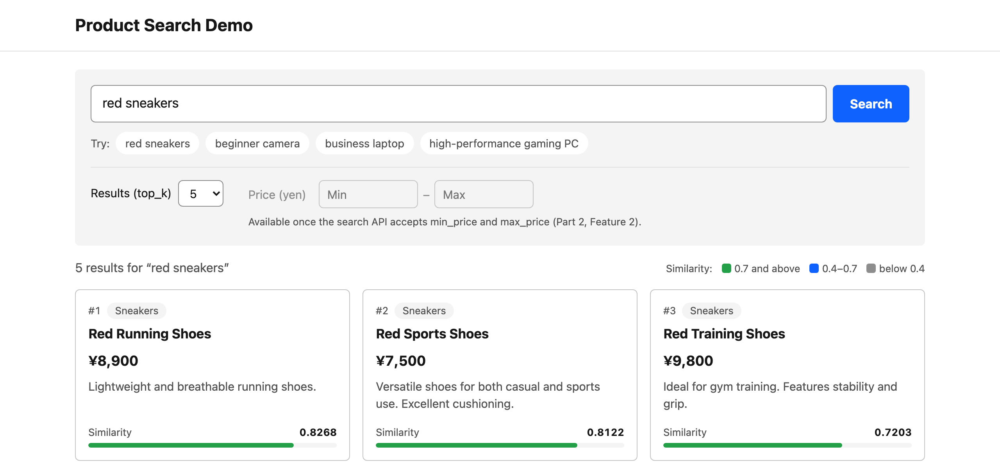

# Part 1: Experience Vector Search

In this part, you'll experience how Vector Search works in practice.

## Goals of This Part

- Understand what Vector Search is
- Actually run Vector Search
- Experience the convenience of "semantic search"

## Step 1: What is Vector Search?

### Problems with Traditional Search

#### Example: Searching for Products on an E-Commerce Site

**Your search**: "red sneakers"

**Traditional search results**:

- "red sneakers" → Found
- "red running shoes" → Not found
- "red sports shoes" → Not found

**Why not found?**

- Traditional search only looks for "characters"
- "red" and "red" (in different forms) are treated as different characters

### How Vector Search Works

Vector Search searches by understanding "meaning".

<div class="vector-flow" role="group" aria-label="Vector Search flow" tabindex="0">
  <div class="admonition vector-flow-step" style="--flow-tint: #ecf2ff">
    <p class="admonition-title">Step 1: Text Input</p>
    <p class="vector-flow-content"><strong>User Input</strong><br/>'red sneakers'</p>
  </div>
  <div class="vector-flow-edge"><span>Text</span><span aria-hidden="true">⟶</span></div>
  <div class="admonition vector-flow-step" style="--flow-tint: #f9f5eb">
    <p class="admonition-title">Step 2: Vector Conversion</p>
    <p class="vector-flow-content"><strong>Embedding Model</strong><br/>Text → Vector</p>
  </div>
  <div class="vector-flow-edge"><span>Convert</span><span aria-hidden="true">⟶</span></div>
  <div class="admonition vector-flow-step" style="--flow-tint: #f6f0ff">
    <p class="admonition-title">Step 3: Vector Representation</p>
    <p class="vector-flow-content"><strong>Vector (384 dimensions)</strong><br/>[0.2, 0.8, 0.1, 0.5, ...]</p>
  </div>
  <div class="vector-flow-edge"><span>Search Query</span><span aria-hidden="true">⟶</span></div>
  <div class="admonition vector-flow-step" style="--flow-tint: #edf7f0">
    <p class="admonition-title">Step 4: Similarity Search</p>
    <p class="vector-flow-content"><strong>Milvus</strong><br/>Vector DB</p>
  </div>
  <div class="vector-flow-edge"><span>Similar Vectors</span><span aria-hidden="true">⟶</span></div>
  <div class="admonition vector-flow-step" style="--flow-tint: #fbeef4">
    <p class="admonition-title">Step 5: Search Results</p>
    <p class="vector-flow-content"><strong>Similar Products List</strong><br/>• Red Running Shoes (0.8268)<br/>• Red Sports Shoes (0.8122)<br/>• Red Training Shoes (0.7203)</p>
  </div>
</div>

!!! info "Key Point"
    - Similar meanings result in similar vectors
    - Computers can quickly calculate numerical similarity

**Your search**: "red sneakers"

**Vector Search results**:

- "red sneakers" → Found
- "red running shoes" → Found (similar meaning)
- "red sports shoes" → Found (similar meaning)

**Why found?**

- Vector Search understands "meaning"
- "red" "red" "red" (in various forms) → Understood as the same meaning
- "sneakers" "running shoes" "sports shoes" → Understood as similar meanings

### How Vector Search Operates

```
Step 1: Convert text to numbers
"red sneakers" → [0.2, 0.8, 0.1, 0.5, ...] (vector)

Step 2: Find similar numbers
Search for similar numerical patterns from the database

Step 3: Return results
Return products with similar meanings
```

**Key points**:

- "Vector" = array of numbers
- Similar meanings result in similar numerical patterns
- Computers can quickly calculate numerical similarity

## Step 2: Run Connection Test

!!! example "Practice: Let's get hands-on"
    
    Before running Vector Search, verify that you can connect to the required services.

Enter the following in IBM Bob's chat screen:

```text
Run setup/participant/test_connection.py with the Python in setup/participant/venv
```

IBM Bob runs the connection test script. If IBM Bob asks for approval to run a command, approve it.

??? tip "If Running Manually"
    Enter the following in the terminal:
    
    ```bash
    cd setup/participant
    python test_connection.py
    ```

### Verify Results

#### If Successful

```
==================================================
Milvus Connection Test
==================================================

=== Environment Variable Check ===
✓ MILVUS_HOST: 192.168.1.100
✓ MILVUS_PORT: 19530
✓ MILVUS_USER: root
✓ MILVUS_PASSWORD: ********

=== Milvus Connection Test ===
Connecting to: 192.168.1.100:19530
Auth: user/password auth
✓ Connected to Milvus successfully
✓ Existing collections: 0

==================================================
Test Results
==================================================
Milvus connection: ✓ success

✓ Milvus connection test passed!
  Next step: Create vector collection
```

**What is this?**:

- **Milvus**: Vector database (where data is stored)
- **Embedding model**: Converts text to vectors
- **384 dimensions**: Represents meaning with 384 numbers

The connection test, sample data insertion script, and demo application all read the same `.env` connection settings. If this test succeeds, the next steps use the same Milvus host, port, and authentication method.

#### If Failed

```
✗ Milvus connection error: Connection refused
```

**Solution**:

1. Check the **`.env`** file
    - Verify that the IP address distributed by the instructor is correctly entered in `MILVUS_HOST` ([:material-cog: Configuration method](preparation.md#milvus_host))
    - Verify that `MILVUS_PASSWORD` is the password distributed by the instructor — an authentication error such as "auth check failure" means the password is wrong or still the template placeholder
2. Check internet connection
3. For other errors, refer to [FAQ](#faq)

## Step 3: Insert Sample Data

!!! example "Practice: Insert Sample Data into Milvus"
    
    To experience Vector Search, first insert sample product data.

Enter the following in IBM Bob's chat screen:

```text
Run setup/participant/insert_sample_data.py
```

IBM Bob runs the script and inserts the sample data.

??? tip "If Running Manually"
    Enter the following in the terminal:
    
    ```bash
    # If you are in the project root folder
    cd setup/participant
    python insert_sample_data.py
    ```

    If you are already in the `setup/participant` folder, skip `cd setup/participant`.

### Verify Insertion Results

If you see the following display, it's successful:

```
==================================================
✓ Sample data insertion completed
==================================================

Collection name: products_taro  # the unique name you set in .env
Entity count: 12

You can start the demo application:
  venv/bin/python app.py
==================================================
```

**Inserted data**:

- Number of products: 12
- Categories: Sneakers, Cameras, Computers, Bags
- Each product includes product name, price, description, and embedding vector
- The collection schema and search field names are shared with the demo application, so the inserted data is ready to search immediately

## Step 4: Experience Vector Search

!!! example "Practice: Let's run Vector Search"
    
    Once sample data insertion is successful, let's experience Vector Search.

### Launch Demo Application {#app-restart}

Run this step in the terminal.

Run this after activating the virtual environment created during preparation and installing the packages in `requirements.txt`.

=== ":fontawesome-brands-apple: Mac"
    ```bash
    cd ~/Desktop/vector-search-builder-en/setup/participant
    venv/bin/python app.py
    ```

=== ":fontawesome-brands-windows: Windows"
    ```cmd
    cd %USERPROFILE%\Desktop\vector-search-builder-en\setup\participant
    venv\Scripts\python app.py
    ```

If you are already in the `setup/participant` folder, skip the `cd ...` line.

After running `venv/bin/python app.py` or `venv\Scripts\python app.py`, it may look like nothing is happening at first. Startup can take a little time, so wait until the terminal shows the command output.

#### If Launch Succeeds

If you see output like the following, the application is running.

```text
==================================================
✓ Application started successfully
==================================================

Search screen: http://localhost:8002
==================================================

INFO:     Application startup complete.
```

!!! warning "Keep the Terminal Open"
    Closing the terminal stops the application. Please be careful.

#### If Launch Fails

If `ModuleNotFoundError: No module named 'fastapi'` appears, the required packages are not installed in the virtual environment. Install the required packages ([:material-package-variant-closed: installation steps](preparation.md#install-packages)), then start the demo application again ([:material-play-circle: launch steps](#app-restart)).

### Verify Launch

Open the following URL in your web browser and verify that the search screen (**Product Search Demo**) is displayed:

```text
http://localhost:8002
```

!!! success "Launch Successful"
    
    If the search screen is displayed, the application has started successfully.

### Try Searching

#### Step 1: Enter a Search Query

Type the following in the search box at the top of the screen:

```text
red sneakers
```

#### Step 2: Click "Search"

Click the **Search** button (or press ++enter++)

#### Step 3: Verify Results

Products are displayed as cards, most similar first. The top three are the three red shoes: Red Running Shoes (0.8268), Red Sports Shoes (0.8122), and Red Training Shoes (0.7203), followed by Blue Casual Sneakers. Scores may vary slightly depending on your environment and model version.



**How to read results**:

- **Rank** (`#1`, `#2`, ...): Order of similarity, most similar first
- **Category** (`category`): Product category
- **Product name** (`product_name`): Product name
- **Price** (`price`): Price in US dollars
- **Description** (`description`): Description
- **Similarity** (`similarity_score`): Similarity (0.0-1.0, higher is more similar). The bar is green at 0.7 and above, blue from 0.4 to 0.7, and gray below 0.4

**Results** (`top_k`) sets how many products are returned (default: 5). The price filter stays unavailable until you add it in Part 2.

??? note "Optional: See the raw API response"
    To see the JSON that the search screen displays, open Swagger UI at **`http://localhost:8002/docs`**, open **`/search`**, click "Try it out", enter the request body below, and click "Execute". Swagger UI loads its files from the internet, while the search screen works offline.

    ```json
    {
      "query": "red sneakers",
      "top_k": 1
    }
    ```

    Response (the score may vary slightly):

    ```json
    {
      "results": [
        {
          "product_name": "Red Running Shoes",
          "similarity_score": 0.8268,
          "price": 89,
          "category": "Sneakers",
          "description": "Lightweight and breathable running shoes."
        }
      ]
    }
    ```

### Try Various Searches

Try the following searches as well. You can type them, or click the matching example under the search box.

#### Example 1: Search for beginner-friendly products

```text
beginner camera
```

#### Example 2: Search for business-oriented products

```text
business laptop
```

#### Example 3: Search for high-performance products

```text
high-performance gaming PC
```

### Experience the Power of Vector Search

As you try various searches, you should notice the following:

**Observation 1: Found even with different phrasing**

- "beginner" → "entry-level" "for beginners" are also found

**Observation 2: Similarity scores are useful**

- Higher score = more similar
- You can see the reliability of results

**Observation 3: Descriptions are also considered**

- Understands not just product names but also the meaning of descriptions
- "business laptop" also finds the Lightweight Business Bag, whose description says it fits a laptop

## Part 1 Completion Check

- [ ] Understood what Vector Search is
- [ ] Understood the difference from traditional search
- [ ] Connection test was successful
- [ ] Inserted sample data
- [ ] Launched demo application
- [ ] Opened the search screen
- [ ] Executed search
- [ ] Tried various searches

## FAQ

??? question "Cannot open the search screen"

    1. Verify the application is running
    2. Verify the URL is correct (**`http://localhost:8002`**)
    3. Try a different browser

??? question "Search results are 0"

    1. Verify sample data has been inserted
    2. Try changing the search query

??? question "Similarity scores are extremely low"

    1. Reinsert sample data with the latest `insert_sample_data.py`
    2. Restart the demo application manually
        1. Press ++ctrl+c++ in the terminal running the application (stop)
        2. Execute **`python app.py`** ([:material-play-circle: How to start](#app-restart))
    3. Search again on the search screen

    If the existing collection was created with an older search metric, scores may appear very low, such as 0.06.

[Next →](part2.md){ .workshop-next }
