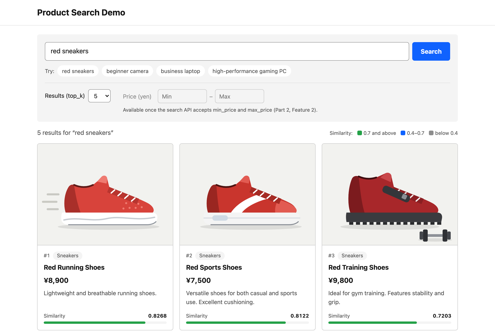
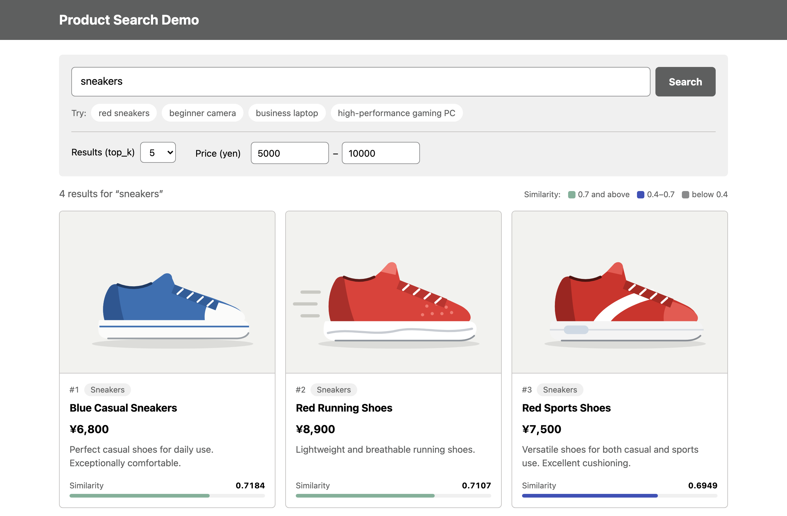
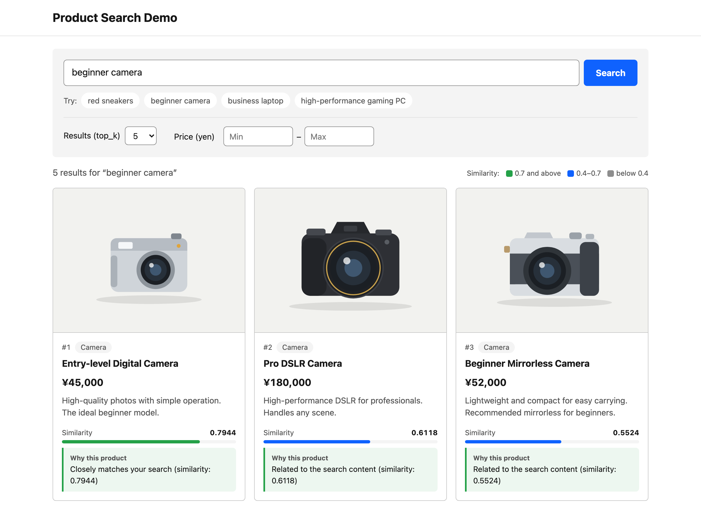

# Part 2: Add Features with IBM Bob

In this part, you'll use IBM Bob to add new features to the Vector Search application.

## Goals of This Part

- Learn how to use IBM Bob
- Give instructions in natural language to generate code
- Add 3 new features

## What is IBM Bob? (Review)

**IBM Bob** = A development tool where AI assists with coding

**What it can do**:

- Tell it in natural language "I want this feature"
- IBM Bob automatically writes the code
- It also explains the code

**Benefits**:

- Reduces coding effort
- Significantly shortens development time
- Generates high-quality code

## Features to Add

In this part, you'll add the following 3 features:

1. **Product image display**
2. **Price filter**
3. **Recommendation reason display**

!!! info "The search screen shows the new fields automatically"
    The search screen displays whatever the **`/search`** API returns. Once the API returns **`image_url`** or **`recommendation_reason`**, or accepts **`min_price`** and **`max_price`**, the screen shows product images or recommendation reasons, or enables its price filter. In this part, you ask IBM Bob to change only the API and the data.

??? note "About hot reload"
    The application has a hot reload feature, but in this hands-on, stop it once before changing code and start it again after the change to ensure the updates are applied.

??? note "Application file structure"
    - `app.py`: Defines the FastAPI API and serves the search screen
    - `schema.py`: Defines the Milvus collection schema, index/search settings, and fields returned in search results
    - `insert_sample_data.py`: Inserts sample product data into Milvus
    - `static/`: The search screen (HTML, JavaScript, and CSS) and the product images (`static/images/product-01.svg` to `product-12.svg`). You do not need to change it in this part

## Feature 1: Product Image Display {#feature-1-product-image-display}

!!! info "Why is this feature needed?"
    
    Current search results are text only. Having product images makes it visually clearer and improves user experience.

### Step 1: Open IBM Bob

Click the chat input field at the bottom of the IBM Bob screen. Keep **Vector Search Builder** selected as the mode.

### Step 2: Stop the Application

Press ++ctrl+c++ in the terminal running the application to stop it.

### Step 3: Give Instructions to IBM Bob

Enter the following in the chat input field and press Enter:

```
Add an image_url field to the /search API JSON response so the search screen can display it.
The product images are static/images/product-01.svg to product-12.svg, in the same order as SAMPLE_PRODUCTS.
```

**Key point**:

- Clearly communicate what you want to do

### Step 4: Wait for IBM Bob's Response

IBM Bob will automatically:

1. Understand the instruction
2. Find related files
3. Generate code
4. Display explanation

### Step 5: Review IBM Bob's Changes

When IBM Bob finishes, the **`/search`** response includes **`image_url`** for each product, such as `/static/images/product-01.svg`. The files IBM Bob edits may vary.

### Step 6: Approve Changes

If IBM Bob asks for approval to run a command, approve it.

### Step 7: Verify Operation

1. If IBM Bob changed `schema.py`, reinsert the sample data because the Milvus collection schema changed:

    ```bash
    python insert_sample_data.py
    ```

    !!! note "Confirmation prompt"
        Because your collection already exists from Part 1, the script asks **`Drop and recreate this collection? [y/N]`**. Answer **`y`** (it only affects your own collection — the unique `COLLECTION_NAME` you set in `.env`).

2. Start the application (execute **`python app.py`**. [:material-play-circle: How to start](part1.md#app-restart))
3. Open the search screen (**`http://localhost:8002`**). If it is already open, reload the page
4. Search for:

    ```text
    red sneakers
    ```

5. Verify results: each product card now shows a product image

    

**Verification point**: Product images are displayed. The API returns **`image_url`** values such as `/static/images/product-01.svg`, and the screen shows the image at that path

### Feature 1 Completion Check

- [ ] Gave instructions to IBM Bob
- [ ] IBM Bob generated code
- [ ] Approved changes
- [ ] Reinserted sample data if the schema changed
- [ ] Product images are displayed in the search results

## Feature 2: Price Filter

!!! info "Why is this feature needed?"
    
    Being able to filter by price range allows finding products within budget.

### Step 1: Stop the Application

Press ++ctrl+c++ in the terminal running the application to stop it.

### Step 2: Give Instructions to IBM Bob

Enter the following in the chat input field and press Enter:

```text
Allow min_price and max_price to be specified in the /search API JSON request.
Return only search results within the specified price range.
```

### Step 3: Review IBM Bob's Changes

When IBM Bob finishes, the **`/search`** request accepts **`min_price`** and **`max_price`**, and only products in that price range are returned.

Price is already stored in the existing Milvus collection, so this feature usually does not require changing `schema.py` or reinserting sample data.

### Step 4: Approve Changes

If IBM Bob asks for approval to run a command, approve it.

### Step 5: Verify Operation

1. Start the application (execute **`python app.py`**. [:material-play-circle: How to start](part1.md#app-restart))
2. Reload the search screen. The price filter is now available
3. Enter **5000** as the minimum price and **10000** as the maximum price, then search for:

    ```text
    sneakers
    ```

4. Verify results: Only products between 5000 and 10000 yen are displayed

    

### Feature 2 Completion Check

- [ ] Gave instructions to IBM Bob
- [ ] Approved changes
- [ ] Price filter works

## Feature 3: Recommendation Reason Display

!!! info "Why is this feature needed?"
    
    Displaying why a product is recommended increases user confidence.

### Step 1: Stop the Application

Press ++ctrl+c++ in the terminal running the application to stop it.

### Step 2: Give Instructions to IBM Bob

Enter the following in the chat input field and press Enter:

```text
Add a recommendation_reason field to the /search API JSON response.
Generate the reason text based on similarity scores.
```

### Step 3: Review IBM Bob's Changes

When IBM Bob finishes, the **`/search`** response includes **`recommendation_reason`** for each product, generated from its similarity score.

The recommendation reason is generated from the search score, so this feature usually does not require changing stored product data.

### Step 4: Approve Changes

If IBM Bob asks for approval to run a command, approve it.

### Step 5: Verify Operation

1. Start the application (execute **`python app.py`**. [:material-play-circle: How to start](part1.md#app-restart))
2. Reload the search screen and search for:

    ```text
    beginner camera
    ```

3. Verify results: each product card shows a recommendation reason under **Why this product**. The wording depends on the code IBM Bob generated

    

### Feature 3 Completion Check

- [ ] Gave instructions to IBM Bob
- [ ] Approved changes
- [ ] Recommendation reason is displayed

## Part 2 Completion Check

- [ ] Added product image display feature
- [ ] Added price filter feature
- [ ] Added recommendation reason display feature
- [ ] All features work correctly

## FAQ

??? question "IBM Bob is not responding"

    1. Check internet connection
    2. Restart IBM Bob

??? question "Changes are not reflected"

    1. Verify file is saved
    2. Restart the application manually
    
        1. Press ++ctrl+c++ in the terminal running the application (stop)
        2. Execute **`python app.py`** ([:material-play-circle: How to start](part1.md#app-restart))
    3. Reload the search screen in the browser
    
    If you see `Address already in use`, the app that IBM Bob started for its own check is still running; reload the screen and continue.

??? question "Error is displayed"

    1. Copy error message
    2. Enter the following in IBM Bob's chat screen:
        
        ```text
        Fix this error
        ```

[Next →](part3.md){ .workshop-next }
