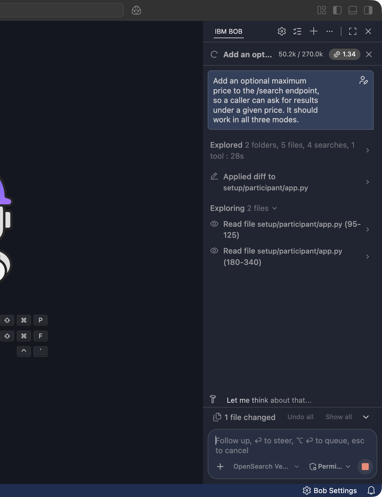
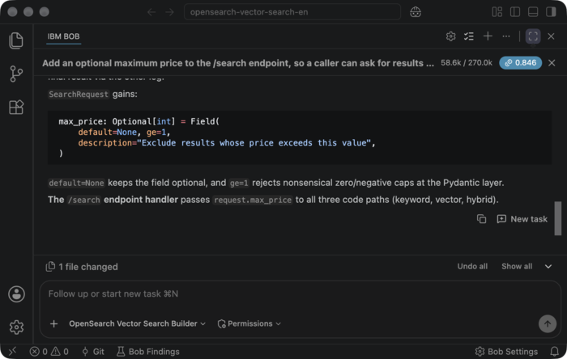

# Part 2: Add Features with IBM Bob

Part 1 ran the search. This part changes it, without you writing the code.

## Goals of This Part

- Add two features by describing them in plain language
- Watch what the Building Block contributes to the answer
- Learn the loop: instruct, read what changed, verify

## How the Loop Works

1. **Instruct**: say what you want, not how to do it.
2. **Watch it work**: Bob explores the project, explains the approach it is taking, and applies the edit.
3. **Read what changed**: the panel reports how many files it touched. **Show all** opens the diff; **Undo all** puts the file back if the change is not what you meant.
4. **Verify**: run the request yourself and check the result.

Steps 3 and 4 are not optional. Bob edits the file first and shows you afterwards, so reviewing the diff is the review, and running the query is the proof. Commands are treated differently from edits: if Bob wants to run one it may stop and ask, offering **Approve once** or **Reject**.

## Feature 1: Filter by Price

Shoppers narrow by budget. Right now `/search` has no way to do that.

With **OpenSearch Vector Search Builder** selected, type this into the chat:

```text
Add an optional maximum price to the /search endpoint, so a caller can ask for
results under a given price. It should work in all three modes.
```

Bob reads the project, states the approach it is taking, and applies the diff to `app.py`:



When it finishes, the panel summarises the change and offers **Show all** and **Undo all**:



### What to Look For in the Answer

This is the interesting part. A price filter sounds trivial, but in a hybrid search it is not, and the mode knows why:

- A filter on the **keyword** side is another clause in the `bool` query.
- A filter on the **vector** side has to be applied as a **k-NN filter**, not afterwards. Filtering k-NN results after the fact silently returns fewer than `top_k` documents, because the graph walk already decided which vectors to look at.
- In **hybrid** mode the same filter has to reach both sides, or the two rankings disagree about what is eligible.

Open **Show all** and read the diff. The run that produced the screenshots above put the filter in all three places correctly:

- `keyword_body` wraps the `multi_match` in a `bool` and adds the range under `filter`, where it narrows the results without touching the BM25 score.
- `vector_body` puts the same range **inside the `knn` clause**, so the graph walk only ever considers documents that qualify.
- `hybrid_hits` passes the limit to both sides, so the two rankings agree on what is eligible.

None of that was in your sentence. It came from the Building Block's rules.

!!! note "Your run will not match word for word"

    Bob writes the change afresh each time, so your helper may be named differently or structured a little differently. What should hold is where the filter lands: inside the `knn` clause on the vector side, in a `filter` clause on the keyword side, and passed to both in hybrid.

### Verify It

```bash
curl -s -X POST http://localhost:8002/search \
  -H 'Content-Type: application/json' \
  -d '{"query": "red sneakers", "mode": "hybrid", "max_price": 8000}'
```

Everything returned should cost 8000 or less. Run the same query without `max_price` and confirm that something above the limit disappears. A filter that changes nothing has not been proven to work. Measured against the sample products:

| `max_price` | `keyword` | `vector` | `hybrid` |
|:---|:---|:---|:---|
| omitted | Blue Casual Sneakers ¥6800, Red Running Shoes ¥8900, Red Sports Shoes ¥7500, Red Training Shoes ¥9800 | Red Sports Shoes ¥7500, Red Running Shoes ¥8900, Red Training Shoes ¥9800, Blue Casual Sneakers ¥6800, Lightweight Business Bag ¥12000 | Blue Casual Sneakers ¥6800, Red Sports Shoes ¥7500, Red Running Shoes ¥8900, Red Training Shoes ¥9800, Lightweight Business Bag ¥12000 |
| `8000` | Blue Casual Sneakers ¥6800, Red Sports Shoes ¥7500 | Red Sports Shoes ¥7500, Blue Casual Sneakers ¥6800 | Red Sports Shoes ¥7500, Blue Casual Sneakers ¥6800 |

The vector column is the one to notice: with the limit it returns two results instead of five, because only two documents qualify. A filter applied after the k-NN search would have returned whatever was left of the original five.

## Feature 2: Explain Why a Result Matched

`hybrid` mode already returns `keyword_score` and `vector_score`. Turn those numbers into something a person can read.

```text
For hybrid results, add a short "match_reason" to each result saying whether it
matched on wording, on meaning, or on both, based on the two component scores.
```

### Verify It

```bash
curl -s -X POST http://localhost:8002/search \
  -H 'Content-Type: application/json' \
  -d '{"query": "a gadget for capturing scenery on a trip", "mode": "hybrid"}'
```

The results that keyword search never found should say so.

## If the Answer Is Wrong

It happens. The useful move is to say what is wrong, not to start again:

```text
The filter is applied after the k-NN search, so a filtered query returns fewer
than top_k results. Apply it inside the knn query instead.
```

Bob keeps the context of the file it just edited, so a correction is cheaper than a rewrite. If you want to abandon a change entirely, `git diff` shows exactly what was touched.

!!! tip "If it starts searching your whole machine"

    Bob sometimes goes looking for tooling. In one of our runs it started a
    `find` across the entire filesystem hunting for a test runner. That is slow and
    buys you nothing here. Press ++esc++ to stop it; the edits it has already
    applied stay applied.

!!! tip "Ask it to explain itself"

    ```text
    Why did you apply the filter inside the knn clause rather than after the search?
    ```

    The answer is a fair summary of what the Building Block's rules say about k-NN filtering, and it is worth reading once.

## What Just Happened

You changed a hybrid search engine twice, in plain language, and the changes were right in the places where OpenSearch is easy to get wrong. The specialised knowledge came from a mode that IBM ships and that you installed by unzipping a file.

!!! success "Checkpoint"

    `/search` now filters by price and explains its matches, and you have run the instruct-read-verify loop end to end.

[Next →](summary.md){ .workshop-next }
