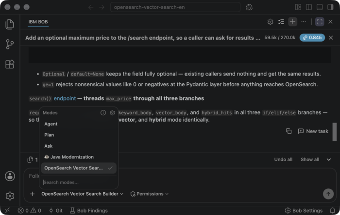

# Preparation

Fifteen minutes of setup: unpack the kit, create a Python environment, fill in `.env`, and point IBM Bob at the Building Block.

## What You Need

- [ ] **IBM Bob IDE 2.1.0** installed
- [ ] **Python 3.11 – 3.14** (`python --version`)
- [ ] The participant package from the instructor (`opensearch-vector-search-en.zip`)
- [ ] OpenSearch connection information from the instructor (host, port, password)
- [ ] An **IBM Cloud API key** and a **watsonx.ai project ID**

!!! warning "Python version"

    The watsonx.ai client (`ibm-watsonx-ai`) requires Python 3.11 or newer and does not yet support 3.15. On 3.10 the install fails with a version error rather than a missing-package error.

!!! info "One product, not two"

    Every step below is for the **IBM Bob IDE**, version **2.1.0**. IBM also ships **Bob shell**, a command-line product on its own release line with its own version number; this hands-on does not cover it.

## Step 1: Unpack the Participant Package

Create a working folder, put the zip in it, and unpack it there.

=== ":fontawesome-brands-apple: Mac"

    ```bash
    mkdir -p ~/vector-search-hands-on
    cd ~/vector-search-hands-on
    unzip ~/Downloads/opensearch-vector-search-en.zip
    ```

=== ":fontawesome-brands-windows: Windows"

    ```powershell
    mkdir $HOME\vector-search-hands-on
    cd $HOME\vector-search-hands-on
    Expand-Archive $HOME\Downloads\opensearch-vector-search-en.zip -DestinationPath .
    ```

You get two directories:

```console
.bob/                                  ← the Building Block: mode, rules, skill
  custom_modes.yaml
  rules-opensearch-builder/
  skills/opensearch-vector-search/
setup/participant/                     ← the scripts you will run
  app.py  common.py  index_mapping.py  insert_sample_data.py
  requirements.txt  sample_products*.py  test_connection.py
  .env.example
```

Unpacking at the top of the folder is what installs the Building Block: IBM Bob looks for `.bob/custom_modes.yaml` in the folder you open, so the mode arrives with the files.

## Step 2: Create the Python Environment

=== ":fontawesome-brands-apple: Mac"

    ```bash
    cd setup/participant
    python3 -m venv venv
    source venv/bin/activate
    pip install -r requirements.txt
    ```

=== ":fontawesome-brands-windows: Windows"

    ```powershell
    cd setup\participant
    python -m venv venv
    venv\Scripts\activate
    pip install -r requirements.txt
    ```

The install pulls about 240 MB and takes a couple of minutes. Nothing is downloaded at run time: the embedding model runs in watsonx.ai, not on your machine.

## Step 3: Fill In `.env`

```bash
cp .env.example .env
```

Open `.env` and replace every placeholder.

### OpenSearch (from the instructor)

```bash
OPENSEARCH_HOST=192.168.1.100          # the address the instructor gives you
OPENSEARCH_PORT=9200
OPENSEARCH_USER=admin
OPENSEARCH_PASSWORD=...                # distributed by the instructor
OPENSEARCH_USE_SSL=true
OPENSEARCH_VERIFY_CERTS=false          # the hands-on cluster uses a self-signed certificate
```

### watsonx.ai (yours)

```bash
IBM_API_KEY=...                        # IBM Cloud → Manage → Access (IAM) → API keys
WATSONX_URL=https://us-south.ml.cloud.ibm.com
WATSONX_PROJECT_ID=...                 # watsonx.ai project → Manage → General → Project ID
EMBEDDING_MODEL_ID=ibm/granite-embedding-278m-multilingual
```

If the instructor provides a shared environment, such as a reservation whose output already
includes an API key, use the key and project from that environment instead of creating your
own.

### Your own index

```bash
INDEX_NAME=products_taro               # anything unique to you
PARTICIPANT_LANGUAGE=en
```

!!! danger "The cluster is shared"

    Every participant writes to the same OpenSearch node. `INDEX_NAME` is what keeps your documents separate from everyone else's, and the loader warns you before deleting an index that already exists. Pick a name nobody else would choose.

!!! info "Keep `.env` out of version control"

    `.env` holds your API key. The repository ignores it; do not commit it, and do not paste the key into a chat with IBM Bob.

## Step 4: Select the Building Block Mode in IBM Bob

Open the folder you unpacked into, the one containing `.bob/`, with **File → Open Folder…**.

### Trust the folder first

A folder opens in **Restricted Mode**, and a banner says so. Until you trust it, extensions stay limited and **Bob does not appear at all**: no Bob entry, no way to open the panel.

1. In the banner, choose **Manage**.
2. Under **In a Trusted Folder**, choose **Trust**.
3. Close the trust editor.

The **Open Bob** button appears as soon as the folder is trusted.

### Choose the mode

1. Click **Open Bob** to open the Bob panel.
2. At the bottom of the chat input, open the mode selector. It reads **Agent** to begin with.
3. Choose **OpenSearch Vector Search Builder**.



The list varies from machine to machine, since it shows every mode installed on yours. All that matters is that **OpenSearch Vector Search Builder** is in it, since that is the mode the kit brought. If it is missing, the folder you opened is not the one holding `.bob/`.

Once selected, the mode name replaces **Agent** under the chat input, and Bob answers from the Building Block's rules for the rest of the session.

## Step 5: Confirm Everything Is Connected

```bash
python test_connection.py
```

You are ready when you see the k-NN plugin line and a vector dimension:

```console
✓ Connected to OpenSearch successfully (version 3.8.0)
✓ k-NN plugin is available (opensearch-knn)
✓ Embedding generated: ibm/granite-embedding-278m-multilingual
✓ Vector dimension: 768
```

## What the Building Block Contains

Everything under `.bob/` comes from IBM's Building Blocks repository and is shipped here unmodified, with one recorded exception.

| Item | Source |
|:---|:---|
| Repository | [ibm-self-serve-assets/building-blocks](https://github.com/ibm-self-serve-assets/building-blocks) |
| Commit | `4a2ee334bf0acb4a798dc197e6f63bde99b9a0d6` |
| Mode archive | `data/pipelines/rag/bob-modes/base-modes/opensearch-builder.zip` (blob `efa9473d0146246c08a3ef9351f882b0b7a58e02`) |
| Skill archive | `data/pipelines/rag/bob-skills/opensearch-vector-search.zip` (blob `916e1f974f3a420006f76335bff14e5c3d64c9ae`) |

- `.bob/custom_modes.yaml`: the **OpenSearch Vector Search Builder** persona (slug `opensearch-builder`)
- `.bob/rules-opensearch-builder/1_opensearch_vector_workflow.xml`: cluster setup, index creation, ingestion, hybrid search
- `.bob/rules-opensearch-builder/2_best_practices.xml`: the practices the persona applies
- `.bob/skills/opensearch-vector-search/SKILL.md`: the skill, which fixes the embedding model and dimension and forbids inventing endpoints

### The One Change

Upstream writes the mode's name as a YAML block scalar with its content on the same line:

```yaml
    name: >- OpenSearch Vector Search Builder
```

A block scalar indicator has to be the last thing on its line, so the file is not valid YAML. PyYAML, Ruby's Psych, the npm `yaml` package and `js-yaml` all reject it at line 3. We did not test the unmodified file in IBM Bob, so we cannot say what its parser does with it; the kit ships the corrected line instead, so the mode loads without that question mattering. The shipped copy uses a plain scalar:

```yaml
    name: OpenSearch Vector Search Builder
```

Nothing else differs. `lib/check_upstream_building_blocks.sh` re-downloads both archives at the pinned commit, checks their blob ids, applies that one line, and diffs the result against what the kit ships; CI runs it on every build.

[Next →](part1.md){ .workshop-next }
