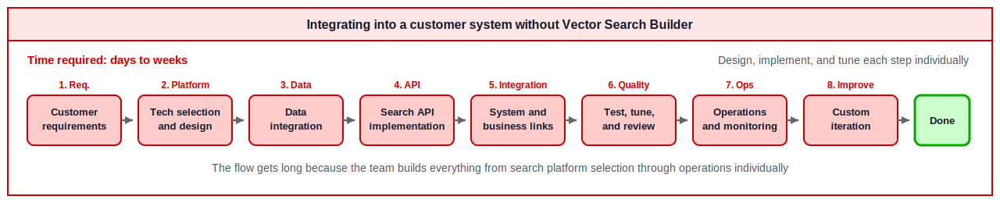
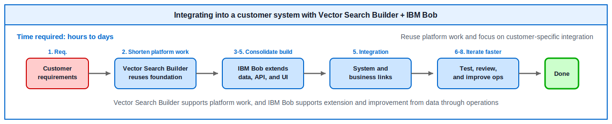

# Summary

This completes the Vector Search hands-on. Great work! 🍺

## What You Learned

### Value of Building Blocks + IBM Bob

- **Significant development time reduction**: Completed in approximately 90 minutes what would take days to weeks
- **High-quality implementation**: Code generation based on best practices
- **Natural language instructions**: Feature addition possible without programming knowledge

### Implemented Features

1. **Product image display**: Added images to search results
2. **Price filter**: Filter by price range
3. **Recommendation reason**: Display why a product is recommended

### Vector Search Overview

- Searches by understanding the "meaning" of words
- Unlike traditional character search, finds similar meanings even with different phrasing

??? example "Use Cases in IBM Products"
    - **watsonx Discovery**: Automatically extracts relevant information from large volumes of documents and presents optimal answers to user questions (product image display)
    - **watsonx Assistant**: Understands customer inquiries and automatically generates optimal responses from similar past cases (price filter)
    - **watsonx Orchestrate**: Understands entire business processes and automatically executes appropriate workflows according to user intent (recommendation reason)

??? example "Use Cases in Familiar Services"
    - **Google Search**: Finds pages and answer candidates with similar meaning even when the words do not exactly match (recommendation reason)
    - **Amazon**: Finds products by description or use case even when the product name is unknown, and recommends similar products (product image display, price filter, recommendation reason)
    - **YouTube**: Suggests videos users may want to watch next based on viewing history and video similarity (product image display, recommendation reason)
    - **Netflix**: Recommends titles close to watched genres, atmosphere, and viewing patterns (product image display, recommendation reason)
    - **Spotify**: Finds music close to favorite songs or playlists and reflects it in recommendations and automatic playlists (product image display, recommendation reason)
    - **Instagram**: Ranks posts and ads based on similarity in photos, videos, hashtags, and interests (product image display, recommendation reason)
    - **Facebook**: Shows feeds, groups, and ads close to post content and user interests (product image display, recommendation reason)
    - **TikTok**: Recommends short videos close to user preferences based on watching, skipping, and likes (product image display, recommendation reason)
    - **Google Photos / Apple Photos**: Finds photos with meaning close to words such as "sea", "dog", or "sunset" (product image display)
    - **ChatGPT / AI Chat**: Searches internal documents or knowledge close to a question and uses them as answer evidence (recommendation reason)

## Deployment to Production Environment

### Current Configuration (For Learning)

- **Hugging Face + Milvus**: Completely free, offline support, optimal for learning

### Migration to IBM Products

- **watsonx.ai**: Enterprise-grade, advanced models, commercial support
- **watsonx.data**: Large-scale data integration, governance features, petabyte support

### Selection Guide

| Scale | Recommended Configuration |
|------|---------|
| Learning/PoC | Hugging Face + Milvus |
| Small-scale production | Hugging Face + Milvus |
| Medium-scale production | watsonx.ai + Milvus |
| Large-scale production | watsonx.ai + watsonx.data |

## Value in Customer Systems

When integrating Vector Search into a customer's existing system, it is not enough to build only a search API. You need to connect data integration, embedding generation, vector databases, search APIs, screen display, and operations design. By using **Vector Search Builder + IBM Bob**, teams can reuse the foundation for technology selection and implementation while focusing on customer-specific requirements.

**When integrating into a customer system without Vector Search Builder:**

**When integrating into a customer system with Vector Search Builder + IBM Bob:**

This difference makes it easier to deliver the following value in projects.

- **Faster startup**: Prepare the basic Vector Search configuration in a short time
- **Focus on customer requirements**: Spend time on differentiating parts such as business data, screens, search conditions, and explanation text
- **Easier iteration**: Quickly tune search results and UI by asking IBM Bob in natural language

## Challenge

??? challenge "Advanced Challenge: Comparison of Search Methods in Agentic RAG"

    **Theme**: Investigate the differences in Harness Engineering between Lexical Search and Vector Search in Agentic RAG!

    **Investigation Points**
    
    1. **Lexical Search**
        - Traditional search like keyword matching, BM25
        - Search accuracy through exact or partial matching
        - Use cases in Agentic RAG
    
    2. **Vector Search**
        - Search based on semantic similarity
        - Representation learning through embedding models
        - Use cases in Agentic RAG
    
    3. **Harness Engineering**
        - How to combine both methods
        - Hybrid search implementation patterns
        - Scoring and re-ranking strategies
    
    4. **Differences in Agentic RAG**
        - Impact on agent decision-making
        - Relationship between search accuracy and response quality
        - Cost and performance trade-offs
    
    **Recommended Approach**
    
    - Implement and compare both methods in actual use cases
    - Quantitatively evaluate search accuracy, response time, and cost
    - Utilize Building Blocks' Agent Builder mode
    - Document and share evaluation results
    
    Through this challenge, you can understand important decision points in RAG system design.

## Reference Materials

- [Building Blocks Documentation](https://ibm-self-serve-assets.github.io/building-blocks-docs/)
- [Vector Search Builder Documentation](https://ibm-self-serve-assets.github.io/building-blocks-docs/data-core/retrieval/vector-search/?h=vector)
- [IBM Bob IDE Documentation](https://bob.ibm.com/docs/ide)
- [Hugging Face Transformers](https://huggingface.co/docs/transformers)
- [Sentence Transformers](https://www.sbert.net/)
