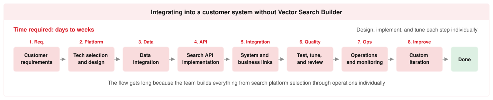
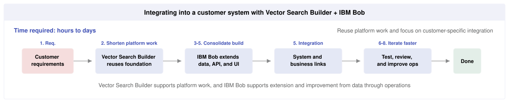

# Summary

This completes the Vector Search hands-on. Great work! 🍺

## What You Learned

### Value of Building Blocks + IBM Bob

- **Significant development time reduction**: Completed in approximately 60 minutes what would take days to weeks
- **High-quality implementation**: Code generation based on best practices
- **Natural language instructions**: Feature addition possible without programming knowledge

### Implemented Features

1. **Product image display**: Added images to search results
2. **Price filter**: Filter by price range
3. **Recommendation reason**: Display why a product is recommended

### Vector Search Overview

- Searches by understanding the "meaning" of words
- Unlike traditional character search, finds similar meanings even with different phrasing

## Deployment to Production Environment

### Current Configuration (For Learning)

- **Hugging Face + Milvus**: Completely free, offline support, optimal for learning

### Migration to IBM Products

- **watsonx.ai**: Enterprise-grade, advanced models, commercial support
- **watsonx.data**: Large-scale data integration, governance features, petabyte support

### Selection Guide

| Scale | Recommended Configuration |
|------|---------|
| Learning, PoC, and small-scale production | Hugging Face + Milvus |
| Medium-scale production | watsonx.ai + Milvus |
| Large-scale production | watsonx.ai + watsonx.data |

## Value in Customer Systems

When integrating Vector Search into a customer's existing system, it is not enough to build only a search API. You need to connect data integration, embedding generation, vector databases, search APIs, screen display, and operations design. By using **Vector Search Builder + IBM Bob**, teams can reuse the foundation for technology selection and implementation while focusing on customer-specific requirements.

**When integrating into a customer system without Vector Search Builder:**

**When integrating into a customer system with Vector Search Builder + IBM Bob:**

This difference makes it easier to deliver the following value in projects.

- **Faster startup**: Prepare the basic Vector Search configuration in a short time
- **Focus on customer requirements**: Spend time on differentiating parts such as business data, screens, search conditions, and explanation text
- **Easier iteration**: Quickly tune search results and UI by asking IBM Bob in natural language

## Reference Materials

- [Building Blocks Documentation](https://ibm-self-serve-assets.github.io/building-blocks-docs/)
- [Building Blocks Vector Search documentation](https://ibm-self-serve-assets.github.io/building-blocks-docs/ai-core/data/vector-search/)
- [IBM Bob IDE Documentation](https://bob.ibm.com/docs/ide)
- [Hugging Face Transformers](https://huggingface.co/docs/transformers)
- [Sentence Transformers](https://www.sbert.net/)

[Next →](feedback.md){ .workshop-next }
